# 5장. 안정 해시 설계

수평적 규모 확장성을 달성하기 위해서는 요청 또는 데이터를 서버에 균등하게 나누는 것이 중요한데, 안정 해시는 이 목표를 달성하기 위해 보편적으로 사용하는 기술이다.

## 해시 키 재배치(rehash) 문제

N개의 캐시 서버가 있을 때, 이 서버들에 부하를 균등하게 나누는 보편적 방법은 다음 해시 함수를 사용한다.

> serverIndex = hash(key) % N (N은 서버의 개수이다.)
> 

이 방법은 서버 풀(server pool)의 크기가 고정되어 있을 때, 그리고 데이터 분포가 균등할 때는 잘 동작하지만, 서버가 추가되거나 기존 서버가 삭제되면 문제가 생긴다.

- 서버 풀의 변동이 생기면 키에 대한 해시값은 변하지 않지만 서버 인덱스 값이 달라지게 되고, 이에 키가 재분배되어 캐시 클라이언트가 데이터가 없는 엉뚱한 서버에 접속하게 되는 문제가 발생할 수 있다.
- 안정 해시는 이 문제를 효과적으로 해결하는 기술이다.

## 안정 해시

- **해시 테이블 크기가 조정될 때 평균적으로 오직 k/n 개의 키만 재배치하는 해시 기술**
    - k = 키의 개수 / n = 슬롯(slot)의 개수
- 전통적 해시 테이블은 슬롯의 수가 바뀌면 거의 대부분 키를 재배치한다.

### 해시 공간과 해시 링

- 해시 함수 f = SHA-1
- 함수의 출력 값 범위 x0, x1, x2, x3, … xn

이 범위의 해시 공간을 그림으로 나타내면 다음과 같다. 

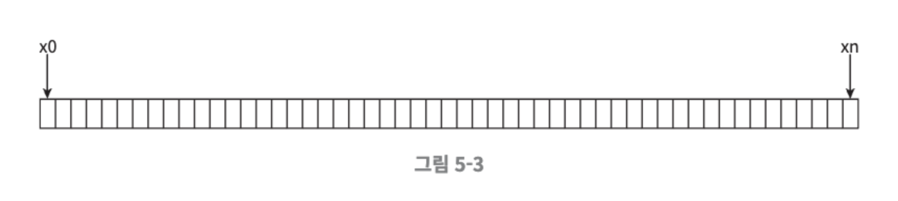

이 해시 공간의 양쪽을 구부려 접으면 그림과 같은 해시 링(hash ring)이 만들어진다.

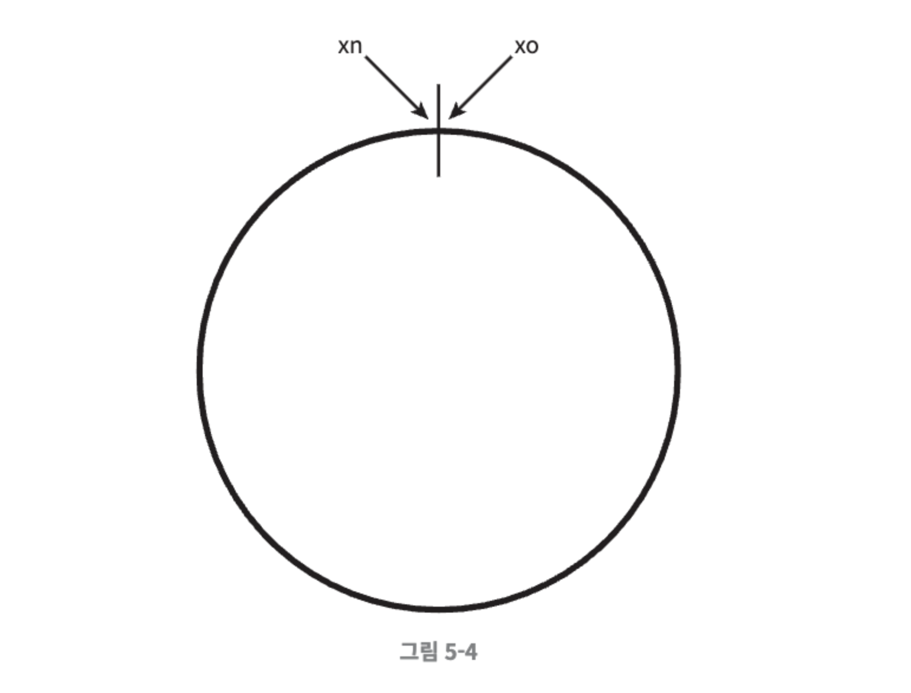

### 해시 서버

이 해시 함수 f를 사용하면 서버 IP나 이름을 이 링 위의 어떤 위치에 대응시킬 수 있다. 4개의 서버를 이 해시 링 위에 배치한 결과는 다음과 같다.

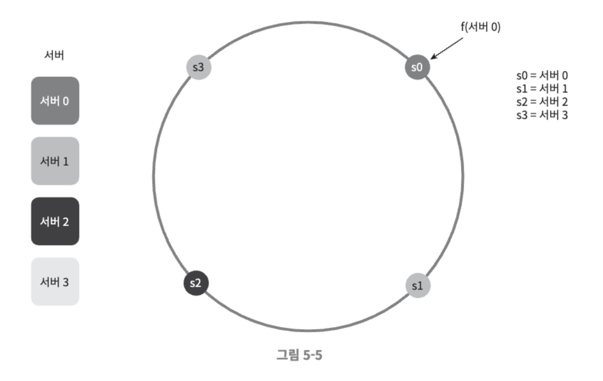

### 해시 키

여기 사용된 해시 함수는 “해시 키 재배치 문제”에 언급된 함수와는 다르며, 나머지 연산 %은 사용하고 있지 않다.

다음과 같이 캐시할 키 key0, key1, key2, key3 또한 해시 링 위의 어느 지점에 배치할 수 있다.

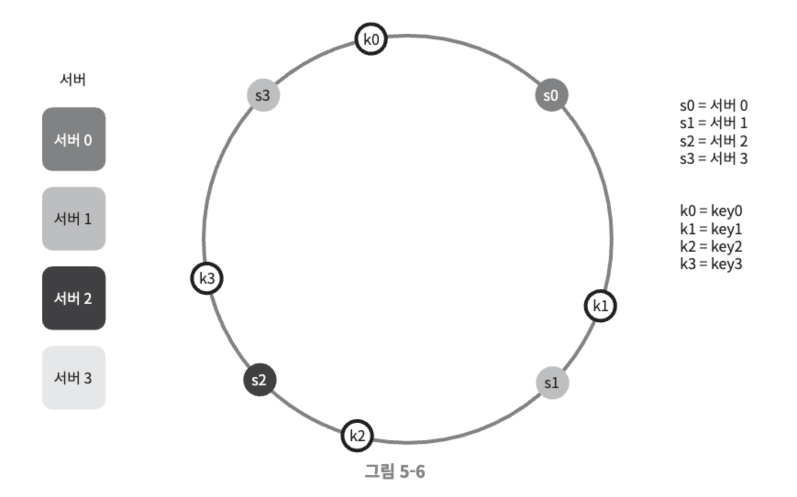

### 서버 조회

어떤 키가 저장되는 서버는, 해당 키의 위치로부터 시계 방향으로 링을 탐색해 나가면서 만나는 첫 번째 서버이다.

다음과 같이 key0은 서버 0에 저장되고, key1은 서버 1에 저장되며, key2는 서버 2, key3은 서버 3에 저장된다.

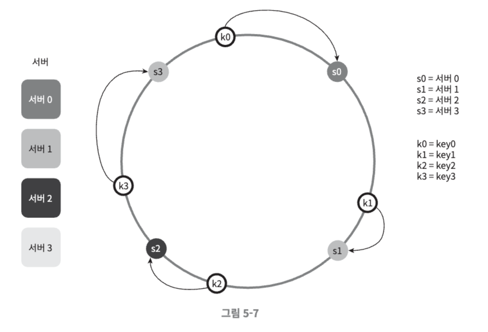

### 서버 추가

방금 설명한 내용에 따르면, 서버를 추가하더라도 키 가운데 일부만 재배치하면 된다. 아래 그림을 보면 새로운 서버 4가 추가된 뒤에 key0만 재배치되고 k1, k2, k3는 같은 서버에 남는다. **key0의 위치에서 시계 방향으로 순회했을 때 처음으로 만나게 되는 서버가 서버 4**이기 때문에 key0은 서버 0에 저장되어 있다가 서버 4가 추가된 뒤에는 서버 4로 재배치 된 것이다. 다른 키들은 재배치되지 않는다.

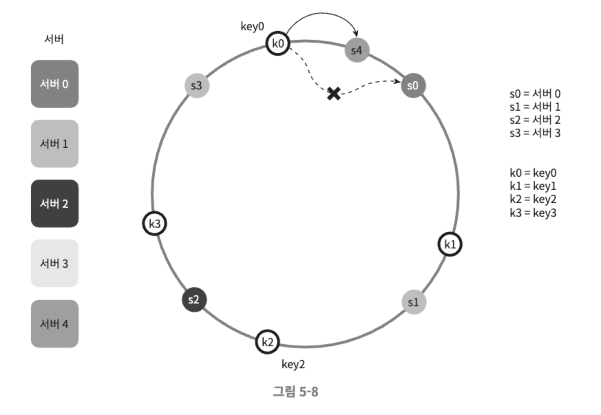

### 서버 제거

하나의 서버가 제거되면 키 가운데 일부만 재배치된다. 다음과 같이 서버 1이 삭제되었을 때 key1만이 서버 2로 재배치 됨을 알 수 있다. 나머지 키에는 영향이 없다.

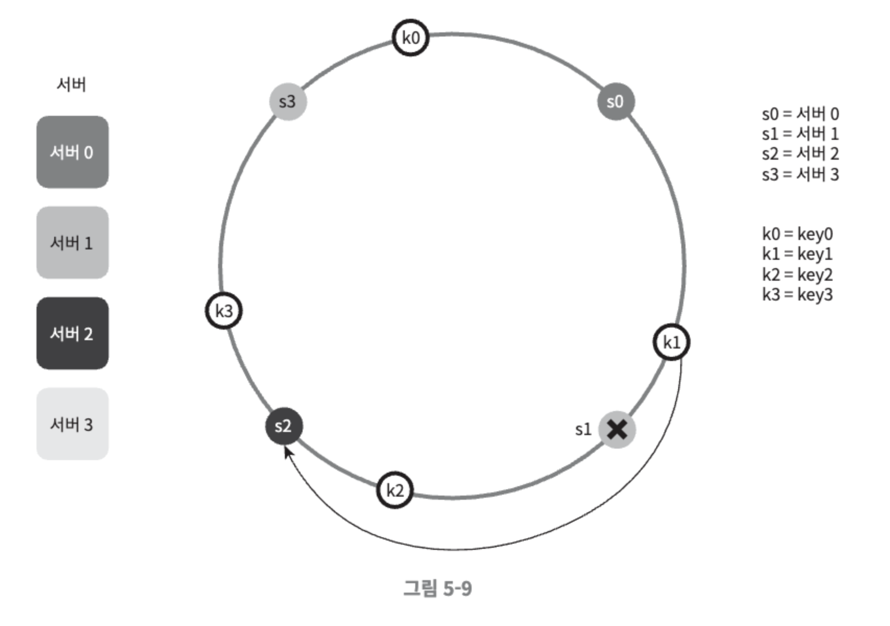

### 기본 구현법의 두 가지 문제

안정 해시 알고리즘은 MIT에서 처음 제안되었는데, 그 기본 절차는 다음과 같다.

- 서버와 키를 균등 분포(uniform distribution) 해시 함수를 사용해 해시 링에 배치한다.
- 키의 위치에서 링을 시계 방향으로 탐색하다 만나는 최초의 서버가 키가 저장될 서버다.

**이 접근법에는 두 가지 문제가 있다.**

1. 서버가 추가되거나 삭제되는 상황을 감안하면 **파티션(partition)의 크기를 균등하게 유지하는게 불가능**하다
    - 여기서 파티션은 인접한 서버 사이의 해시 공간이다.
    - 어떠한 서버는 굉장히 작은 해시 공간을 할당 받고, 어떤 서버는 굉장히 큰 해시 공간을 할당 받는 상황이 가능하다.
    - 다음 그림은 s1이 삭제되는 바람에 s2의 파티션이 다른 파티션 대비 거의 두 배로 커지는 상황을 보여준다.
    
    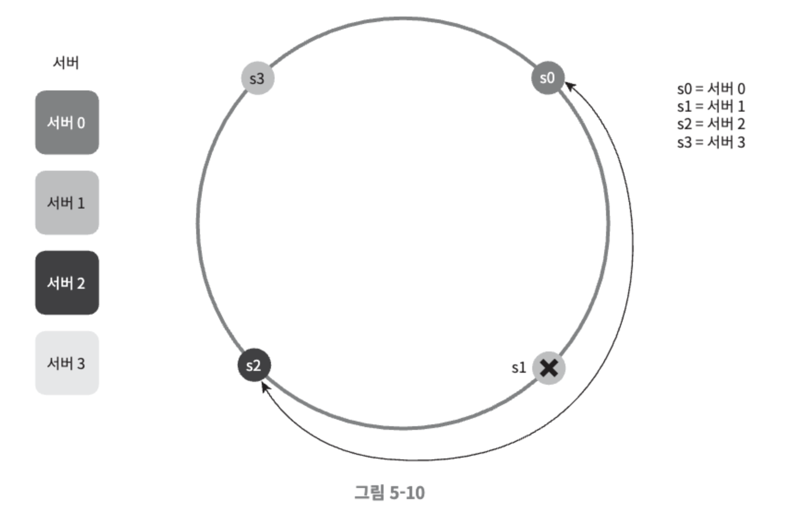
    
2. 키의 균등 분포(uniform distribution)를 달성하기가 어렵다
    - 다음과 같이 서버가 배치되어 있을 때, 서버 1과 서버 3은 아무 데이터도 갖지 않는 반면, 대부분의 키는 서버 2에 보관될 것이다.
    
    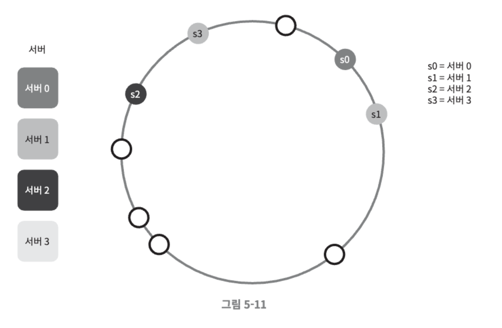
    
    - 이 문제를 해결하기 위해 가상 노드(virtual node) 또는 복제(replica) 기법이 있다.

**가상 노드(virtual node)**

실제 노드 또는 서버를 가리키는 노드로서, 하나의 서버는 링 위에 여러 개의 가상 노드를 가질 수 있다. 다음 그림 5-12를 보면 서버 0과 서버 1은 3개의 가상 노드를 갖는다. 여기서 숫자 3은 임의로 정한 것이며 실제 시스템에서는 그보다 훨씬 큰 값이 사용된다. 

- 서버 0을 링에 배치하기 위해 s0 하나만 쓰는 대신, s0_0, s0_1, s0_2 세 개 가상 노드를 사용하였다.
- 서버 1을 링에 배치할때는 s1_0, s1_1, s1_2 세 개의 가상 노드를 사용하였다.

따라서 각 서버는 하나가 아닌 여러 개 파티션을 관리해야 한다. 그림 5-12에서 s0으로 표시된 파티션은 서버 0이 관리하는 파티션이고, s1으로 표시된 파티션은 서버 1이 관리하는 파티션이다.

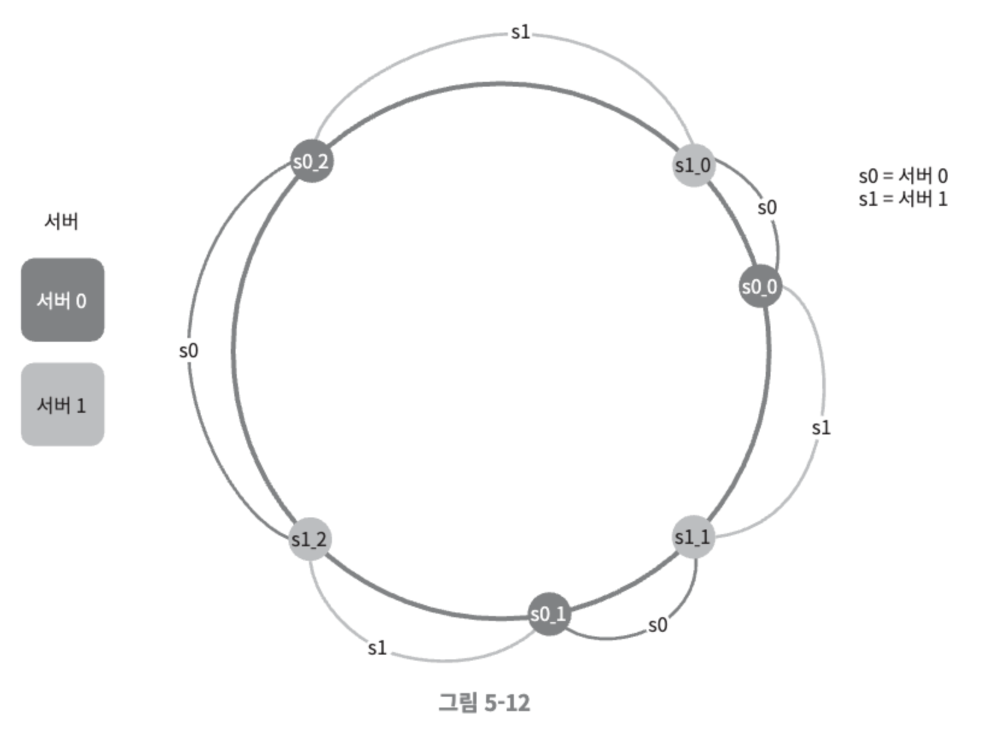

키의 위치로부터 시계방향으로 링을 탐색하다 만나는 최초의 가상 노드가 해당 키가 저장될 서버가 된다. 다음 그림은 그 예제이다.

 k0가 저장되는 서버는 k0의 위치로부터 링을 시계방향으로 탐색하다 만나는 최초의 가상 노드 s1_1가 나타내는 서버, 즉 서버 1이다.

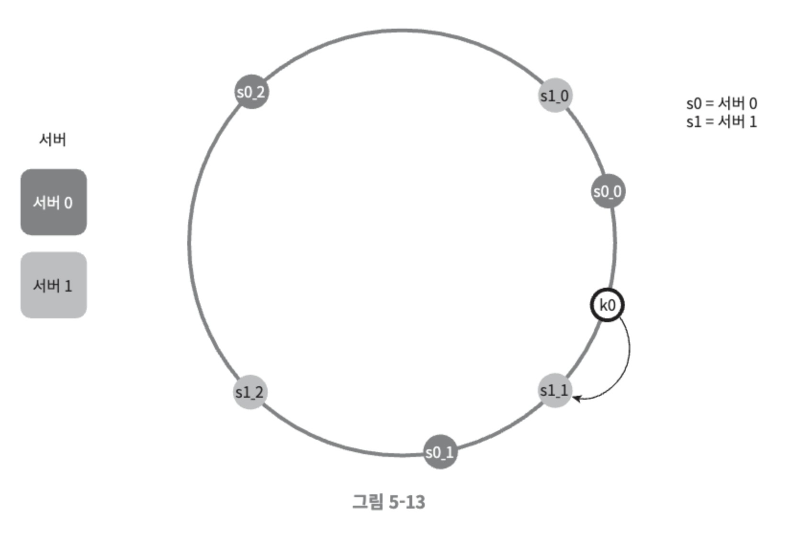

가상 노드의 개수를 늘리면 표준 편차가 작아져서 데이터가 고르게 분포되기 때문에 키의 분포는 점점 더 균등해진다. 표준 편차는 데이터가 어떻게 퍼져 나갔는지를 보이는 척도다. 가상 노드의 개수를 더 늘리면 표준 편차의 값은 더 떨어지지만 가상 노드 데이터를 저장할 공간은 더 많이 필요하게 된다. 따라서 시스템 요구사항에 맞도록 가상 노드 개수를 적절히 조정해야 한다.

**재배치할 키 결정**

서버가 추가되거나 제거되면 데이터 일부는 재배치해야 한다. 어느 범위의 키가 재배치 되어야할까?

다음 그림처럼 서버 4가 추가되었다고 할 때, 이에 영향 받은 범위는 s4(새로 추가된 노드)부터 그 반시계 방향에 있는 첫 번째 서버 s3까지이다. 즉 s3부터 s4 사이에 있는 키들을 s4로 재배치하여야 한다.

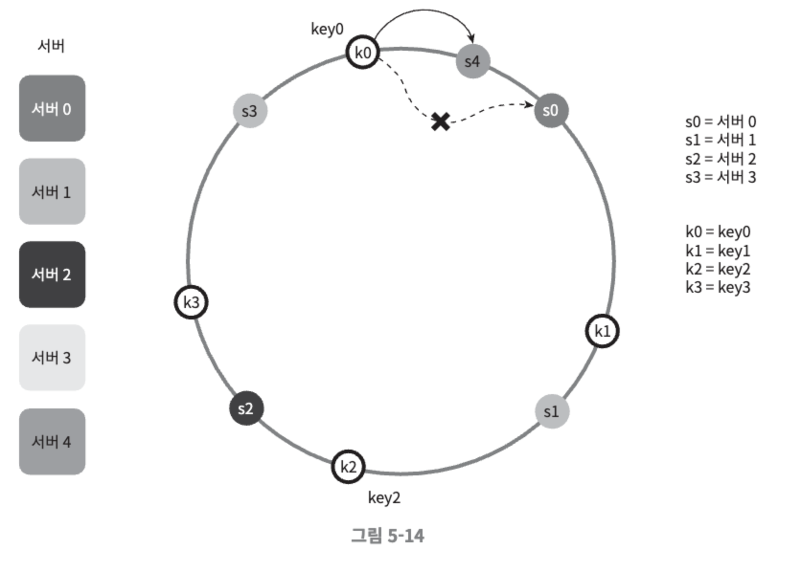

서버 s1이 다음 5-15와 같이 삭제되면 s1부터(삭제된 노드) 그 반시계 방향에 있는 최초 서버 s0 사이에 있는 키들이 s2로 재배치되어야 한다.

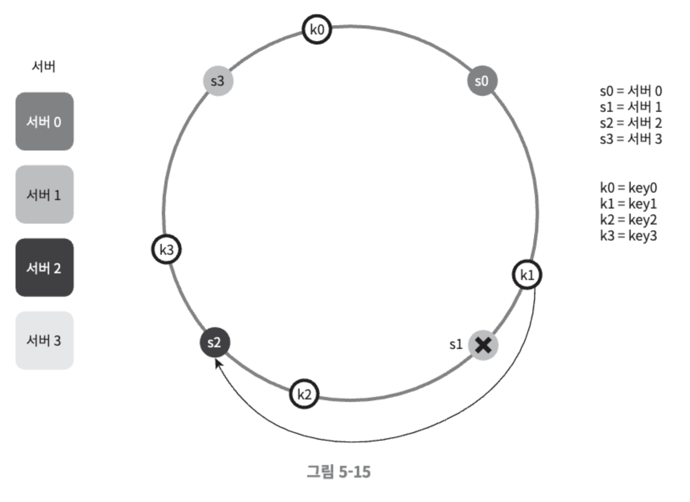

### 안정 해시의 이점

- 서버가 추가되거나 삭제될 때 재배치되는 키의 수가 최소화된다.
- 데이터가 보다 균등하게 분포하게 되므로 수평적 규모 확장성을 달성하기 쉽다.
- 핫스팟(hotspot)문제를 줄인다. 특정한 샤드에 대한 접근이 지나치게 빈번하면 서버 과부하 문제가 생길 수 있다. 안정 해시는 데이터를 좀 더 균등하게 분배하므로 이런 문제가 생길 가능성을 줄인다.
- 안정 해시의 기술은 널리 쓰이는데 몇 가지 예는 다음과 같다.
    - 아마존 다이나모 데이터베이스(DynamoDB)의 파티셔닝 관련 컴포넌트
    - 아파치 카산드라(Apache Cassandra) 클러스터에서의 데이터 파티셔닝
    - 디스코드 채팅 어플리케이션
    - 아카마이 CDN
    - 매그레프 네트워크 부하 분산기