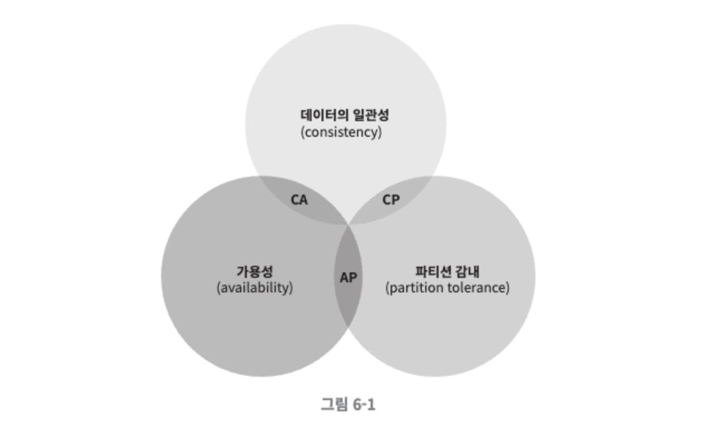
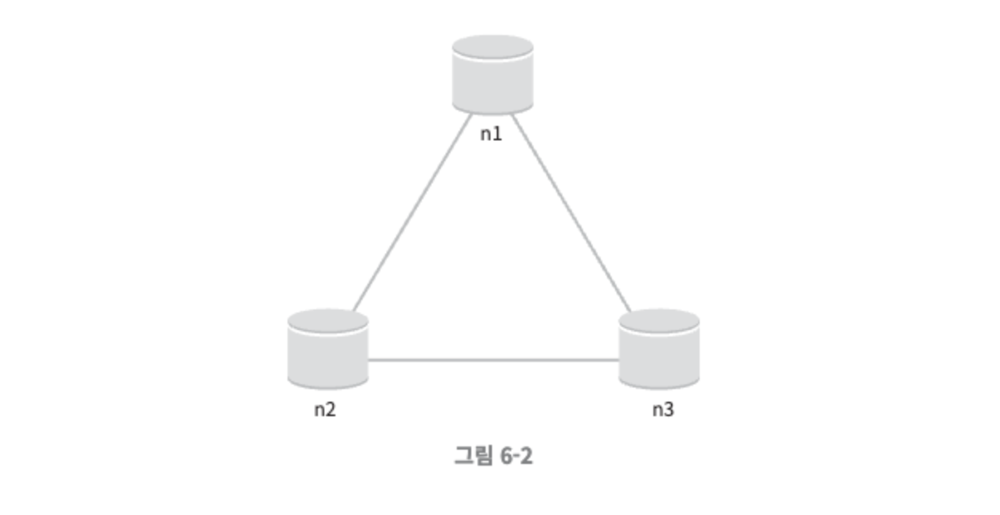
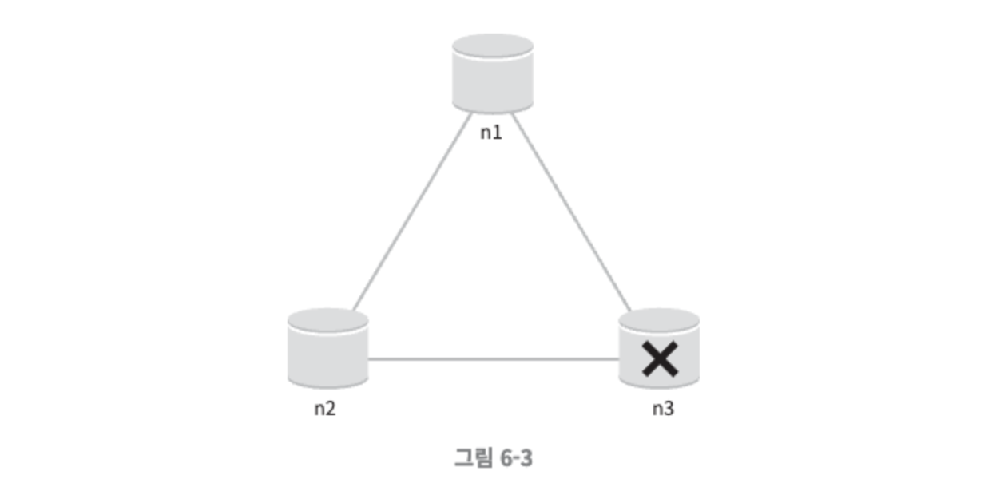
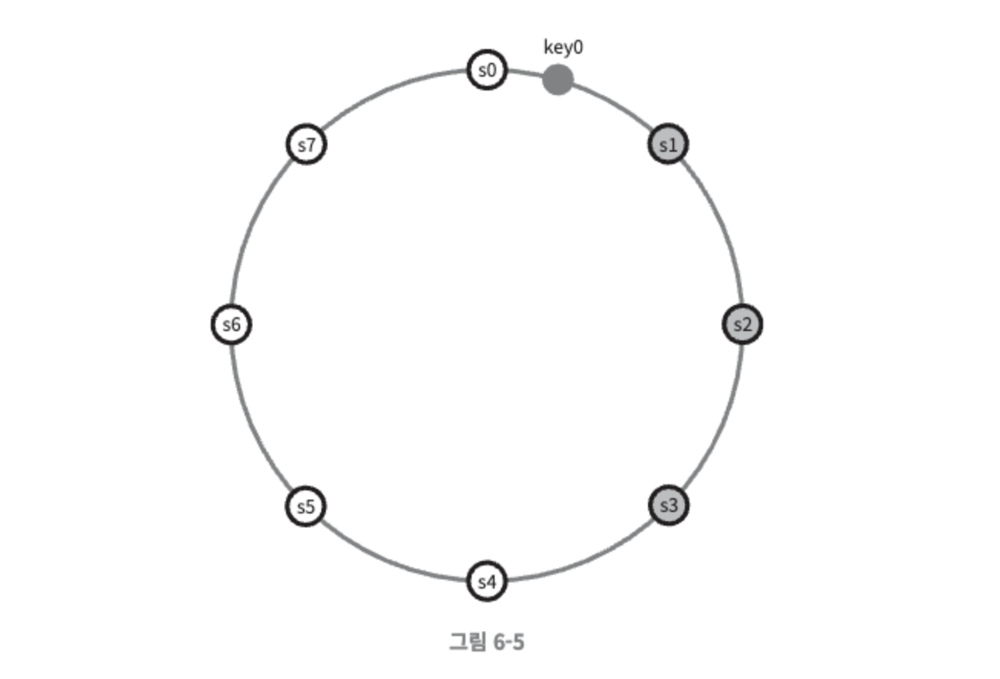
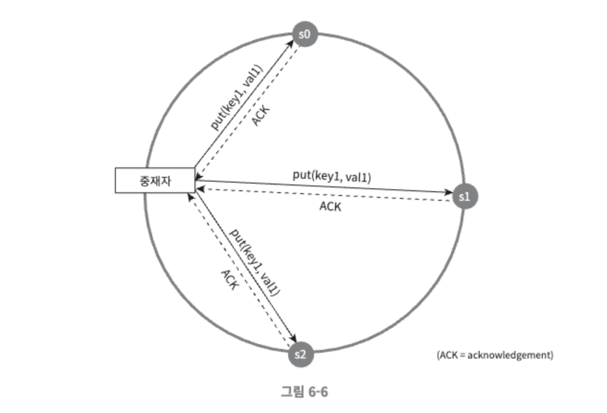
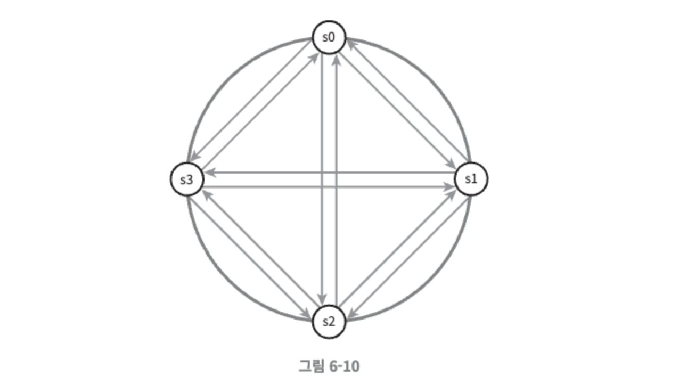
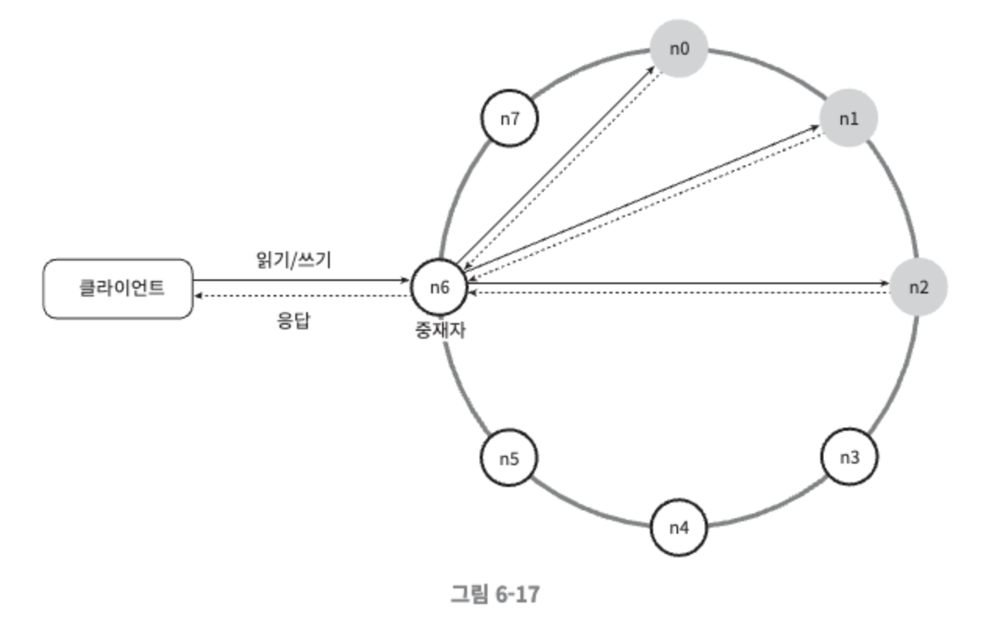

# 6장. 키-값 저장소 설계

키-값 저장소(key-value store)는 키-값 데이터베이스라고도 불리는 비 관계형 데이터베이스이다. 이 저장소에 저장되는 값은 고유 식별자(identifier)를 키로 가져야 하는데, 키와 값 사이의 이런 연결 관계를 “키-값” 쌍이라고 지칭한다.

**키-값 저장소에서의 키**

키-값 쌍에서의 키는 유일해야 하며 해당 키에 매달린 값은 키를 통해서만 접근할 수 있다. 키는 일반 텍스트일수도 있고 해시 값일 수도 있다. 성능상의 이유로, 키는 짧을수록 좋다. 

- 일반 텍스트 키 : “last_logged_in_at”
- 해시 키: 253DDEC4

**키-값 쌍에서의 값**

키-값 쌍에서의 값은 문자열일 수도 있고 리스트(list)일 수도 있고 객체(object)일 수도 있다. 키-값 저장소는 보통 값으로 무엇이 오든 상관하지 않는다. 키-값 저장소로 널리 알려진 것으로는 아마존 다이나모, memcached, 레디스 같은 것들이 있다.

이번 장에서 다음 연산을 지원하는 키-값 저장소를 설계해 볼 것이다.

- put(key, value) : 키-값 쌍을 저장소에 저장한다.
- get(key) : 인자로 주어진 키에 매달린 값을 꺼낸다.

## 문제 이해 및 설계 범위 확정

완벽한 설계란 없으며, 읽기, 쓰기 그리고 메모리 사용량 사이에 어떤 균형을 찾고, 데이터의 일관성과 가용성 사이에서 타협적 결정을 내린 설계를 만들었다면 쓸만한 답안일 것이다. 

이번 장에서는 다음 특성을 갖는 키-값 저장소를 설계해 볼 것이다.

- 키-값 쌍의 크기는 10KB 이하이다.
- 큰 데이터를 저장할 수 있어야 한다.
- 높은 가용성을 제공해야 한다. 따라서 시스템은 설사 장애가 있더라도 빨리 응답해야 한다.
- 높은 규모 확장성을 제공해야 한다. 따라서 트래픽 양에 따라 자동적으로 서버 증설/삭제가 이루어져야 한다.
- 데이터 일관성 수준은 조정이 가능해야 한다.
- 응답 지연시간(latency)이 짧아야 한다.

## 단일 서버 키-값 저장소

- 한 대 서버만 사용하는 키-값 저장소를 설계하는 것은 쉬운데, 가장 직관적인 방법은 키-값 쌍 전부를 메모리에 해시 테이블로 저장하는 것이다.
    - 그러나 이 접근법은 빠른 속도를 보장하긴 하지만 모든 데이터를 메모리 안에 두는 것이 불가능할 수도 있다는 약점을 갖고 있다.
    - 문제를 해결하기 위한 개선책
        - 데이터 압축
        - 자주 쓰이는 데이터만 메모리에 두고 나머지는 디스크에 저장
- 많은 데이터를 저장하려면 분산 키-값 저장소를 만들 필요가 있다.

## 분산 키-값 저장소

- 분산 키-값 저장소는 키-값 쌍을 여러 서버에 분산시키기 때문에 분산 해시 테이블이라고도 불린다.
- 분산 시스템을 설계할 때는 CAP 정리를 이해하고 있어야 한다.

### CAP 정리

데이터 일관성(consistency), 가용성(availability), 파티션 감내(partition tolerance)라는 세 가지 요구사항을 동시에 만족하는 분산 시스템을 설계하는 것은 불가능하다는 정리다.

- 데이터 일관성 : 분산 시스템에 접속하는 모든 클라이언트는 어떤 노드에 접속했느냐에 관계없이 언제나 같은 데이터를 보게 되어야 한다.
- 가용성 : 분산 시스템에 접속하는 클라이언트는 일부 노드에 장애가 발생하더라도 항상 응답을 받을 수 있어야 한다.
- 파티션 감내 : 파티션은 두 노드 사이에 통신 장애가 발생하였음을 의미한다. 파티션 감내는 네트워크에 파티션이 생기더라도 시스템은 계속 동작하여야 한다는 것을 뜻한다.

CAP 정리는 그림 6-1에서와 같이 이들 가운데 어떤 두 가지를 충족하려면 나머지 하나는 반드시 희생되어야 한다는 것을 의미한다.

키-값 저장소는 앞서 제시한 세 가지 요구사항 가운데 어느 두 가지를 만족하느냐에 따라 다음과 같이 분류할 수 있다.

- CP 시스템 : 일관성과 파티션 감내를 지원하는 키-값 저장소. 가용성을 희생한다.
- AP 시스템 : 가용성과 파티션 감내를 지원하는 키-값 저장소. 데이터 일관성을 희생한다.
- CA 시스템 : 일관성과 가용성을 지원하는 키-값 저장소. 파티션 감내는 지원하지 않는다. 그러나 통상 네트워크 장애는 피할 수 없는 일이므로, 분산 시스템은 반드시 파티션 문제를 감내할 수 있도록 설계되어야 한다. 따라서 실세계에 CA 시스템은 존재하지 않는다.

**이상적 상태**

이상적 환경이라면 네트워크가 파티션되는 상황은 절대로 일어나지 않을 것이다. n1에 기록된 데이터는 자동적으로 n2와 n3에 복제된다. 데이터 일관성과 가용성도 만족된다.

**실세계의 분산 시스템**

분산 시스템은 파티션 문제를 피할 수 없다. 그리고 파티션 문제가 발생하면 우리는 일관성과 가용성 사이에서 하나를 선택해야 한다. 

그림 6-3은 n3에 장애가 발생하여 n1 및 n2와 통신할 수 없는 상황을 보여주고 있다. 클라이언트가 n1 또는 n2에 기록한 데이터는 n3에 전달되지 않는다. n3에 기록되었으나 아직 n1 및 n2로 전달되지 않은 데이터가 있다면 n1과 n2는 오래된 사본을 갖고 있을 것이다.

- 일관성을 선택한다면 (CP 시스템)
    - 세 서버 사이에 생길 수 있는 데이터 불일치 문제를 피하기 위해 n1과 n2에 대해 쓰기 연산을 중단시켜야 하는데, 그렇게 하면 가용성이 깨진다.
    - 은행권 시스템은 보통 데이터 일관성을 양보하지 않는다.
        - 예를 들어, 온라인 뱅킹 시스템이 계좌 최신 정보를 출력하지 못한다면 큰 문제가 됨
    - 네트워크 파티션 때문에 일관성이 깨질 수 있는 상황이 발생하면 이런 시스템은 상황이 해결될 때까지는 오류를 반환해야 한다.
- 가용성을 선택한다면 (AP 시스템)
    - 낡은 데이터를 반환할 위험이 있더라도 계속 읽기 연산을 허용해야 한다.
    - 아울러 n1과 n2는 계속 쓰기 연산을 허용할 것이고, 파티션 문제가 해결된 뒤에 새 데이터를 n3에 전송할 것이다.

분산 키-값 저장소를 만들때는 그 요구사항에 맞도록 CAP 정리를 적용해야 한다. 이 문제에 대해 면접관과 상의하고, 그 결론에 따라 시스템을 설계하도록 하자.

### 시스템 컴포넌트

이번 절에서는 키-값 저장소 구현에 사용될 핵심 컴포넌트들 및 기술들을 살펴볼 것이다.

- 데이터 파티션
- 데이터 다중화(replication)
- 일관성(consistency)
- 일관성 불일치 해소(inconsistency resolution)
- 장애 처리
- 시스템 아키텍처 다이어그램
- 쓰기 경로(write path)
- 읽기 경로(read path)

이번 절에 다루는 내용은 널리 사용되고 있는 세 가지 키-값 저장소, 즉 다이나모(Dynamo), 카산드라(Cassandra), 빅테이블(BigTable)의 사례를 참고한 것이다.

**데이터 파티션**

대규모 애플리케이션의 경우 데이터를 작은 파티션들로 분할한 다음 여러 대 서버에 저장한다. 데이터를 파티션 단위로 나눌 때는 다음 두 가지 문제를 중요하게 따져봐야 한다.

- 데이터를 여러 서버에 고르게 분산할 수 있는가
- 노드가 추가되거나 삭제될 때 데이터의 이동을 최소화할 수 있는가

5장에서 다룬 안정 해시는 이런 문제를 푸는 데 적합한 기술이다.

안정 해시를 사용하여 데이터를 파티션하면 좋은 점은 다음과 같다.

- 규모 확장 자동화 : 시스템 부하에 따라 서버가 자동으로 추가되거나 삭제되도록 만들 수 있다.
- 다양성 : 각 서버의 용량에 맞게 가상 노드의 수를 조정할 수 있다. 즉, 고성능 서버는 더 많은 가상 노드를 갖도록 설정할 수 있다.

**데이터 다중화**

높은 가용성과 안정성을 확보하기 위해서는 데이터를 N개 서버에 비동기적으로 다중화할 필요가 있다. 여기서 N은 튜닝 가능한 값으로, N개 서버를 선정하는 방법은 이러하다. 

어떤 키를 해시 링 위에 배치한 후, 그 지점으로부터 시계 방향으로 링을 순회하면서 만나는 첫 N개 서버에 데이터 사본을 보관하는 것이다. N=3으로 설정한 그림 6-5의 예제에서 key0은 s1, s2, s3에 저장된다.

가상 노드를 사용한다면 위와 같이 선택한 N개의 노드가 대응될 실제 물리 서버의 개수가 N보다 작아질 수 있다. 이 문제를 피하려면 노드를 선택할 때 같은 물리 서버를 중복 선택하지 않도록 해야 한다.

같은 데이터 센터에 속한 노드는 정전, 네트워크 이슈, 자연재해 등의 문제를 동시에 겪을 가능성이 있다. 따라서 안정성을 담보하기 위해 데이터의 사본은 다른 센터의 서버에 보관하고, 센터들은 고속 네트워크로 연결한다.

**데이터 일관성**

여러 노드에 다중화된 데이터는 적절히 동기화가 되어야 한다. 정족수 합의 프로토콜을 사용하면 읽기/쓰기 연산 모두에 일관성을 보장할 수 있다.

- N=사본 개수
- W=쓰기 연산에 대한 정족수. 쓰기 연산이 성공한 것으로 간주되려면 적어도 W개의 서버로부터 쓰기 연산이 성공했다는 응답을 받아야 한다.
- R=읽기 연산에 대한 정족수. 읽기 연산이 성공한 것으로 간주되려면 적어도 R개의 서버로부터 응답을 받아야 한다.

그림 6-6과 같이 N=3인 경우 데이터가 s0, s1, s2에 다중화되는 상황을 예로 들었을 때 

W=1의 의미

- 쓰기 연산이 성공했다고 판단하기 위해 중재자(coordinator)는 최소 한 대 서버로부터 쓰기 성공 응답을 받아야 한다는 뜻
- 따라서 s1으로부터 성공 응답을 받았다면 s0, s2로부터의 응답은 기다릴 필요가 없다.
    - 중재자는 클라이언트와 노드 사이에서 프락시(proxy) 역할을 한다.

W, R, N의 값을 정하는 것은 응답 지연과 데이터 일관성 사이의 타협점을 찾는 전형적인 과정이다.

- W=1 or R=1인 구성의 경우 중재자는 한 대 서버로부터의 응답만 받으면 되니 응답속도가 빠르다.
- W>1 or R>1인 구성의 경우 시스템이 보여주는 데이터 일관성의 수준은 향상될 테지만 중재자의 응답 속도는 가장 느린 서버로부터의 응답을 기다려야 하므로 느려질 것이다.
- W+R > N 인 경우에는 일관성을 보증할 최신 데이터를 가진 노드가 최소 하나는 겹칠 것이기 때문에 강한 일관성이 보장된다.

면접 시에는 N, W, R 값을 어떻게 정해야 할까? 요구되는 일관성 수준에 따라 W, R, N의 값을 조정하면 된다.

- R=1, W=N : 빠른 읽기 연산에 최적화된 시스템
- W=1, R=N : 빠른 쓰기 연산에 최적화된 시스템
- W+R > N : 강한 일관성이 보장됨 (보통 N=3, W=R=2)
- W+R ≤ N : 강한 일관성이 보장되지 않음.

**일관성 모델**

일관성 모델(consistency model)은 키-값 저장소를 설계할 때 고려해야 할 또 하나의 중요한 요소다. 일관성 모델은 데이터 일관성의 수준을 결정하는데, 종류가 다양하다.

- 강한 일관성(strong consistency) : 모든 읽기 연산은 가장 최근에 갱신된 결과를 반환한다. 클라이언트는 절대로 낡은 데이터를 보지 못한다.
- 약한 일관성(weak consistency) : 읽기 연산은 가장 최근에 갱신된 결과를 반환하지 못할 수 있다.
- 최종 일관성(eventual consistency) : 약한 일관성의 한 형태로, 갱신 결과가 결국에는 모든 사본에 반영(즉, 동기화)되는 모델이다.

강한 일관성을 달성하는 일반적인 방법은, 모든 사본에 현재 쓰기 연산의 결과가 반영될 때까지 해당 데이터에 대한 읽기/쓰기를 금지하는 것이다. 이 방법은 새로운 요청의 처리가 중단되기 때문에 고가용성 시스템에는 적합하지 않다.

최종 일관성 모델을 따를 경우 쓰기 연산이 병렬적으로 발생하면 시스템에 저장된 값의 일관성이 깨어질 수 있는데, 이 문제는 클라이언트 측에서 데이터의 버전 정보를 활용해 일관성이 깨진 데이터를 읽지 않도록 해결해야 한다.

**비 일관성 해소 기법:데이터 버저닝**

데이터를 다중화하면 가용성은 높아지지만 사본 간 일관성이 깨질 가능성은 높아진다. 버저닝과 벡터 시계는 그 문제를 해소하기 위해 등장한 기술이다.

- 버저닝(versioning) : 데이터를 변경할 때 마다 해당 데이터의 새로운 버전을 만드는 것으로, 각 버전의 데이터는 변경 불가능하다.
- 벡터 시계(vector clock) : [서버, 버전]의 순서쌍을 데이터에 매단 것이다. 어떤 버전이 선행 버전인지, 후행 버전인지 아니면 다른 버전과 충돌이 있는지 판별하는데 쓰인다.
    - 벡터 시계를 사용하면 어떤 버전 X가 버전 Y의 이전 버전인지(따라서 충돌이 없는지) 쉽게 판단할 수 있지만 두 가지 분명한 단점이 있다.
        - 충돌 감지 및 해소 로직이 클라이언트에 들어가야 하므로, 클라이언트 구현이 복잡해진다.
        - [서버:버전]의 순서쌍 개수가 굉장히 빨리 늘어난다는 것이다. 이 문제를 해결하려면 그 길이에 어떤 임계치를 설정하고, 임계치 이상으로 길이가 길어지면 오래된 순서쌍을 벡터 시계에서 제거하도록 해야한다.
            - 이렇게 하면 버전 간 선후 관계가 정확하게 결정될 수 없기 때문에 충돌 해소 과정의 효율성이 낮아지게 된다.
            - 하지만 다이나모 데이터베이스에 관계된 문헌에 따르면 아마존은 실제 서비스에서 그런 문제가 벌어지는 것을 발견한 적이 없다고 하기 때문에 대부분의 기업에서 벡터 시계는 적용해도 괜찮은 솔루션일 것이다.

**장애 처리**

대다수 대규모 시스템에서 장애는 그저 불가피하기만 한 것이 아니라 아주 흔하게 벌어지는 사건이다. 따라서 장애를 어떻게 처리할 것이냐 하는 것은 굉장히 중요한 문제다. 

**장애 감지**

분산 시스템에서는 그저 한 대 서버가 “지금 서버 A가 죽었습니다” 라고 한다해서 바로 서버 A를 장애처리 하지는 않는다. 보통 두 대 이상의 서버가 똑같이 서버 A의 장애를 보고해야 해당 서버에 실제로 장애가 발생했다고 간주하게 된다.

그림 6-10과 같이 모든 노드 사이에 멀티캐스팅 채널을 구축하는 것이 서버 장애를 감지하는 가장 손쉬운 방법이지만, 이 방법은 서버가 많을 때는 비효율적이다.

가십 프로토콜(gossip protocol) 같은 분산형 장애 감지 솔루션을 채택하는 편이 보다 효율적이다.

- 동작원리
    - 각 노드는 멤버십 목록을 유지한다. 멤버십 목록은 각 멤버 ID와 그 박동 카운터 쌍의 목록이다.
    - 각 노드는 주기적으로 자신의 박동 카운터를 증가시킨다.
    - 각 노드는 무작위로 선정된 노드들에게 주기적으로 자기 박동 카운터 목록을 보낸다.
    - 박동 카운터 목록을 받은 노드는 멤버십 목록을 최신 값으로 갱신한다.
    - 어떤 멤버의 박동 카운터 값이 지정된 시간 동안 갱신되지 않으면 해당 멤버는 장애 상태인 것으로 간주한다.
    

**일시적 장애 처리**

가십 프로토콜로 장애를 감지한 시스템은 가용성을 보장하기 위해 필요한 조치를 해야 한다. 

- 엄격한 정족수(strict quorum) 접근법을 쓴다면, 앞서 “데이터 일관성” 절에서 설명한 대로 읽기와 쓰기 연산을 금지해야 할 것이다.
- 느슨한 정족수(sloppy quorum) 접근법은 이 조건을 완화하여 가용성을 높인다. 정족수 요구사항을 강제하는 대신, 쓰기 연산을 수행할 W개의 건강한 서버와 읽기 연산을 수행할 R개의 건강한 서버를 해시 링에서 고른다. 이때 장애 상태인 서버는 무시한다.
- 임시 위탁 기법(hinted handoff)
    - 네트워크나 서버 문제로 장애 상태인 서버로 가는 요청은 다른 서버가 잠시 맡아 처리한다. 그동안 발생한 변경사항은 해당 서버가 복구되었을 때 일괄 반영하여 데이터 일관성을 보존한다. 이를 위해 임시로 쓰기 연산을 처리한 서버에는 그에 관한 단서를 남겨둔다.

**영구 장애 처리**

영구적인 노드의 장애 상태를 처리하기 위해 반-엔트로피(anti-entropy) 프로토콜을 구현하여 사본들을 동기화할 것이다. 반-엔트로피 프로토콜은 사본들을 비교하여 최신 버전으로 갱신하는 과정을 포함한다. 사본 간의 일관성이 망가진 상태를 탐지하고 전송 데이터의 양을 줄이기 위해서는 머클(Merkle) 트리를 사용한다.

- 머클(Merkle) 트리
    - 해시 트리라고도 불린다.
    - 각 노드에 그 자식 노드들에 보관된 값의 해시(자식 노드가 종단 노드인 경우), 또는 자식 노드들의 레이블로부터 계산된 해시 값을 레이블로 붙여두는 트리
    - 해시트리를 사용하면 대규모 자료 구조의 내용을 효과적이면서도 보안상 안전한 방법으로 검증할 수 있다.
    - 머클 트리를 사용하면 동기화해야 하는 데이터의 양은 실제로 존재하는 차이의 크기에 비례할 뿐, 두 서버에 보관된 데이터의 총량과는 무관해진다.
    

**데이터 센터 장애 처리**

데이터 센터 장애는 정전, 네트워크 장애, 자연재해 등 다양한 이유로 발생할 수 있다. 데이터 센터 장애에 대응할 수 있는 시스템을 만들려면 데이터를 여러 데이터 센터에 다중화하는 것이 중요하다.

### 시스템 아키텍처 다이어그램

아키텍처 다이어그램을 그려본다. 그림 6-17의 아키텍처의 주된 기능은 다음과 같다.

- 클라이언트는 키-값 저장소가 제공하는 두 가지 단순한 API, 즉 get(key) 및 put(key, value)와 통신한다.
- 중재자(coordinator)는 클라이언트에게 키-값 저장소에 대한 프락시(proxy)역할을 하는 노드다.
- 노드는 안정 해시(consistent hash)의 해시 링(hash ring) 위에 분포한다.
- 노드를 자동으로 추가 또는 삭제할 수 있도록, 시스템은 완전히 분산된다.
- 데이터는 여러 노드에 다중화된다.
- 모든 노드가 같은 책임을 지므로, SPOF는 존재하지 않는다.

### 요약

분산 키-값 저장소가 가져야 하는 기능과 그 기능 구현에 이용되는 기술

| 목표/문제 | 기술 |
| --- | --- |
| 대규모 데이터 저장 | 안정 해시를 사용해 서버들에 부하 분산 |
| 읽기 연산에 대한 높은 가용성 보장 | 데이터를 여러 데이터센터에 다중화 |
| 쓰기 연산에 대한 높은 가용성 보장 | 버저닝 및 벡터 시계를 사용한 충돌 해소 |
| 데이터 파티션 | 안정 해시 |
| 점진적 규모 확장성 | 안정 해시 |
| 다양성(heterogeneity) | 안정 해시 |
| 조절 가능한 데이터 일관성 | 정족수 합의 |
| 일시적 장애 처리 | 느슨한 정족수 프로토콜과 단서 후 임시 위탁 |
| 영구적 장애 처리 | 머클 트리 |
| 데이터 센터 장애 대응 | 여러 데이터 센터에 걸친 데이터 다중화 |