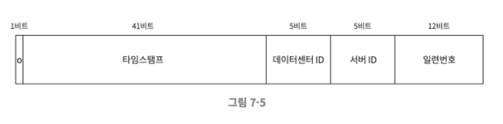
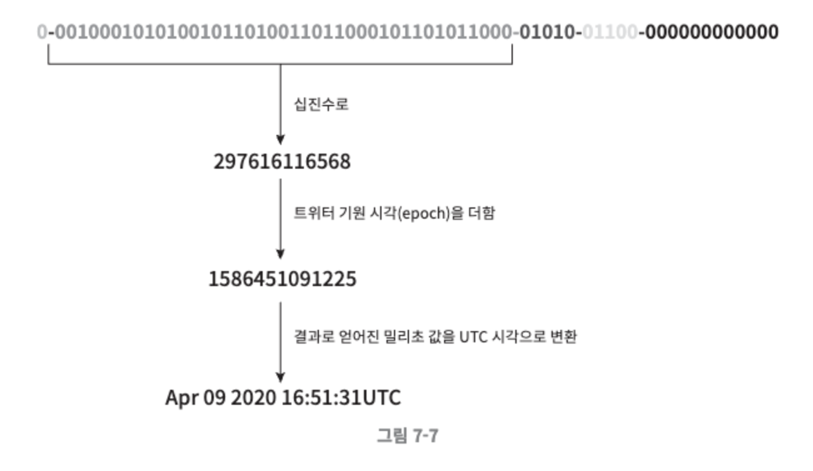

# 7장. 분산 시스템을 위한 유일 ID 생성기 설계

> 관계형데이터베이스의 auto_increment 속성이 설정된 기본 키를 사용하면 되지 않을까?
> 
> - 분산환경에서는 이 방식이 통하지 않는다. 데이터 서버 한 대로는 그 요구를 감당할 수 없을 뿐더러, 여러 데이터베이스 서버를 쓰는 경우에는 지연시간을 낮추기 무척 힘들 것이기 때문이다.

## 1단계. 문제 이해 및 설계 범위 확정

시스템 설계 면접 문제를 푸는 첫 단계는 적절한 질문을 통해 모호함을 없애고 설계 방향을 정하는 것.

- ID는 유일해야 한다.
- ID는 숫자로만 구성되어야 한다.
- ID는 64비트로 표현될 수 있는 값이어야 한다.
- ID는 발급 날짜에 따라 정렬 가능해야 한다.
- 초당 10,000개의 ID를 만들 수 있어야 한다.

## 2단계. 개략적 설계안 제시 및 동의 구하기

분산 시스템에서 유일성이 보장되는 ID를 만드는 방법은 여러가지다. 

- 다중 마스터 복제(multi-master replication)
- UUID(Universally Unique Identifier)
- 티켓 서버(ticket server)
- 트위터 스노플레이크(twitter snowflake) 접근법

### 다중 마스터 복제

데이터베이스의 auto_increment 기능을 활용하는 것으로, 다음 ID의 값을 구할 때 1 만큼 증가시켜 얻는 것이 아니라, k만큼 증가시킨다. (k=현재 사용중인 데이터베이스 서버의 수)

**장점**

- 이렇게 하면 규모 확장성 문제를 어느 정도 해결할 수 있는데, 데이터베이스 수를 늘리면 초당 생산 가능 ID 수도 늘릴 수 있기 때문이다.

**단점**

- 여러 데이터 센터에 걸쳐 규모를 늘리기 어렵다.
- ID의 유일성은 보장되겠지만 그 값이 시간 흐름에 맞추어 커지도록 보장할 수는 없다.
- 서버를 추가하거나 삭제할 때도 잘 동작하도록 만들기 어렵다.

### UUID

컴퓨터 시스템에 저장되는 정보를 유일하게 식별하기 위한 128비트짜리 수다. UUID 값은 충돌 가능성이 지극히 낮다. 위키피디아를 인용하면 “중복 UUID가 1개 생길 확률을 50%로 끌어 올리려면 초당 10억개의 UUID를 100년동안 계속해서 만들어야 한다.”

UUID는 서버 간 조율 없이 독립적으로 생성 가능하다. 각 웹 서버는 별도의 ID 생성기를 사용해 독립적으로 ID를 만들어 낸다.

**장점**

- UUID를 만드는 것은 단순하며, 서버 사이의 조율이 필요 없으므로 동기화 이슈도 없다.
- 각 서버가 자기가 쓸 ID를 알아서 만드는 구조이므로 규모 확장도 쉽다.

**단점**

- ID가 128비트로 길다. 이번 장에서 다루는 문제의 요구사항은 64비트다.
- ID를 시간순으로 정렬할 수 없다.
- ID에 숫자 아닌 값이 표함될 수 있다.

### 티켓 서버

플리커는 분산 기본 키를 만들어 내기 위해 이 기술을 이용하였다. 이 아이디어의 핵심은 auto_increment 기능을 갖춘 데이터베이스 서버, 즉 티켓 서버를 중앙 집중형으로 하나만 사용하는 것이다. 

**장점**

- 유일성이 보장되는 오직 숫자로만 구성된 ID를 쉽게 만들 수 있다.
- 구현하기 쉽고, 중소 규모 애플리케이션에 적합하다.

**단점**

- 티켓 서버가 SPOF(Single-Point-of-Failure)가 된다. 이 서버에 장애가 발생하면, 해당 서버를 이용하는 모든 시스템이 영향을 받는다. 이 이슈를 피하려면 티켓 서버를 여러 대 준비해야 하지만, 그렇게 하면 데이터 동기화와 같은 새로운 문제가 발생할 것이다.

### 트위터 스노플레이크 접근법

트위터는 스노플레이크(snotflake)라고 부르는 독창적인 ID 생성 기법을 사용한다. 이 고무적인 기법은 이번 장에서 풀어야 하는 문제의 요구사항을 만족시킬 수 있다. ID를 직접 생성하기 전에, 각개격파 전략을 먼저 적용해본다. 

생성해야 하는 ID의 구조를 여러 절(secrtion)로 분할한다. 

각 절의 쓰임새를 살펴보면 다음과 같다.

- 사인(sign) 비트 : 1비트를 할당한다. 지금으로서는 쓰임새가 없지만 나중을 위해 유보해 둔다. 음수와 양수를 구별하는 데 사용할 수 있을 것이다.
- 타임스탬프(timestamp): 41비트를 할당한다. 기원 시각 이후로 몇 밀리초가 경과했는지를 나타내는 값이다.
- 데이터센터 ID : 5비트를 할당한다. 따라서 2^5=32개 데이터센터를 지원할 수 있다.
- 서버 ID : 5비트를 할당한다. 따라서 데이터센터당 32개 서버를 사용할 수 있다.
- 일련번호 : 12비트를 할당한다. 각 서버에서는 ID를 생성할 때마다 이 일련번호를 1만큼 증가시킨다. 이 값은 1 밀리초가 경과할 때마다 0으로 초기화 된다.

## 3단계. 상세 설계

개략적 설계를 진행하면서 분산 시스템에서 사용할 유일성 보장 ID 생성기를 설계하는데 쓰일 수 있는 다양한 기술적 선택지를 살펴보았는데, 그 중 트위터 스노우플레이크 접근법을 사용하여 상세한 설계를 진행해보겠다.

그림을 다시 살펴보면, 

- 데이터센터 ID와 서버 ID는 시스템이 시작할 때 결정되며, 일반적으로 시스템 운영중에는 바뀌지 않는다.
- 데이터센터 ID나 서버 ID를 잘못 변경하게 되면 ID 충돌이 발생할 수 있으므로, 그런 작업을 해야 할 때는 신중해야 한다.
- 타임스탬프나 일련번호는 ID 생성기가 돌고 있는 중에 만들어지는 값이다.

### 타임스탬프

타임스탬프는 앞서 살펴본 ID 구조에서 가장 중요한 41비트를 차지하고 있다. 타임스탬프는 시간이 흐름에 따라 점점 큰 값을 갖게 되므로, 결국 ID는 시간순으로 정렬 가능하게 될 것이다. 

- 41비트로 표현할 수 있는 타임스탬프의 최댓값은 2^41-1 = 2199023255551 밀리초이다. (대략 69년)
    - 이 생성기는 69년동안만 정상 동작하는데, 기원 시각을 현재에 가깝게 맞춰서 오버플로가 발생하는 시점을 늦춰 놓은 것이다. 69년이 지나면 기원 시각을 바꾸거나 ID 체계를 다른 것으로 이전하여야 한다.

### 일련번호

일련번호는 12비트이므로, 2^12=4096개의 값을 가질 수 있다. 어떤 서버가 같은 밀리초 동안 하나 이상의 ID를 만들어 낼 경우에만 0보다 큰 값을 갖게 된다.

## 4단계. 마무리

이번 장에서는 유일성이 보장되는 ID 생성기 구현에 쓰일 수 있는 다양한 전략을 살펴보고 그 중 스노플레이크를 선택했는데, 모든 요구사항을 만족하면서도 분산 환경에서 규모 확장이 가능하기 때문이다. 

추가적으로 다음의 내용들을 논의할 수 있다.

- 시계 동기화(clock synchronization)
    - 이번 설계에서 ID 생성 서버들이 전부 같은 시계를 사용한다고 가정하였다. 이런 가정은 하나의 서버가 여러 코어에서 실행될 경우나 여러 서버가 물리적으로 독립된 여러 장비에서 실행되는 경우에 유효하지 않을 수 있다. 이때 시계 동기화를 사용할 수 있다.
    - NTP(Network Time Protocol)은 이 문제를 해결하는 가장 보편적 수단이다.
- 각 절의 길이 최적화
    - 동시성이 낮고 수명이 긴 애플리케이션이라면 일련번호 절의 길이를 줄이고 타임스탬프 절의 길이를 늘리는 것이 효과적일 수도 있을 것이다.
- 고가용성
    - ID 생성기는 필수 불가결(mission critical) 컴포넌트이므로 아주 높은 가용성을 제공해야 할 것이다.