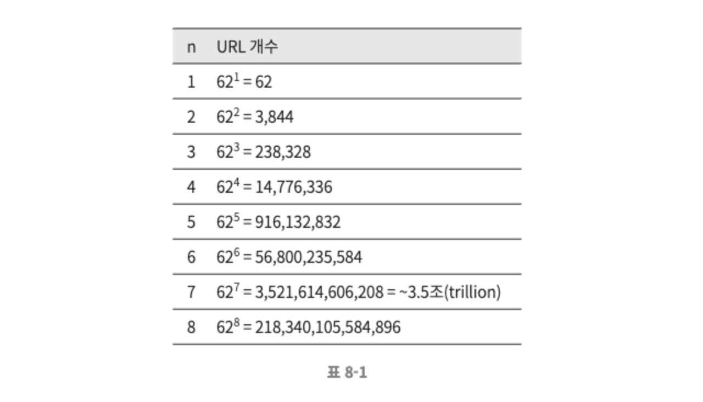
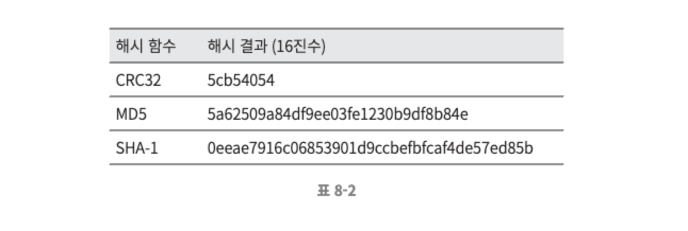
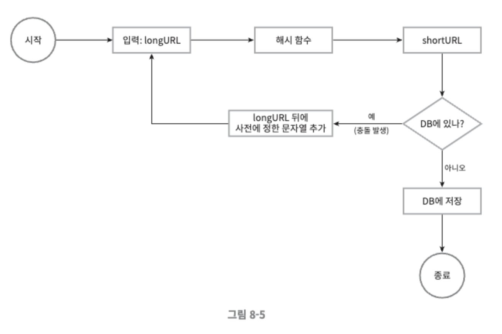
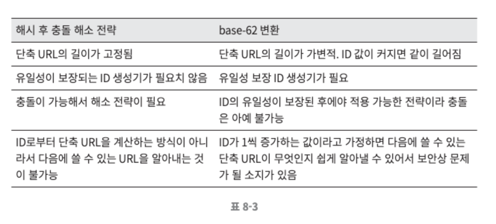
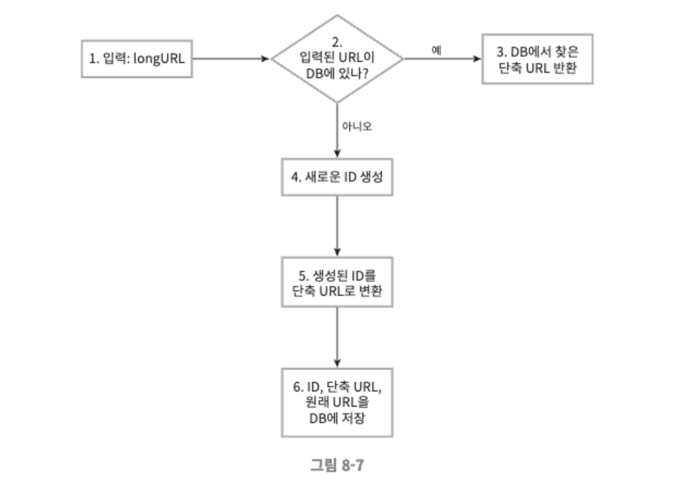
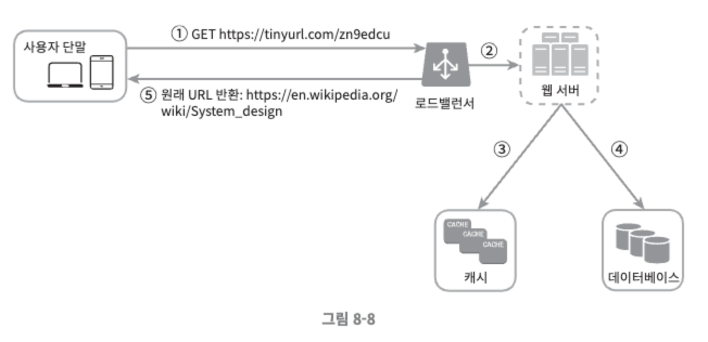

# 8장. URL 단축기 설계

## 1단계. 문제 이해 및 설계 범위 확정

이 시스템의 기본적 기능은 다음과 같다.

- URL 단축 : 주어진 긴 URL을 훨씬 짧게 줄인다.
- URL 리디렉션(redirection) : 축약된 URL로 HTTP 요청이 오면 원래 URL로 안내
- 높은 가용성과 규모 확장성, 그리고 장애 감내가 요구됨

### 개략적 추정

- 쓰기 연산 : 매일 1억 개의 단축 URL 생성
- 초당 쓰기 : 1억(100million) / 24 / 3600 = 1160
- 읽기 연산 : 읽기 연산과 쓰기 연산 비율은 10:1 이라고 할때, 그 경우 읽기 연산은 초당 11,600회 발생한다. (1160 * 10 = 11,600)
- URL 단축 서비스를 10년간 운영한다고 가정하면 1억(100million) * 365 * 10 = 3650억(365billion) 개의 레코드를 보관해야 한다.
- 축약 전 URL의 평균 길이는 100이라고 하자.
- 따라서 10년 동안 필요한 저장 용량은 3650억(365billion) * 100바이트 = 36.5TB 이다.

## 2단계. 개략적 설계안 제시 및 동의 구하기

### API 엔드포인트

URL 단축기는 기본적으로  두 개의 엔드포인트를 필요로 한다.

- URL 단축용 엔드포인트 : 새 단축 URL을 생성하고자 하는 클라이언트는 이 엔드포인트에 단축할 URL을 인자로 실어서 POST 요청을 보내야 한다.
    - POST /api/v1/data/shorten
        - 인자 : {longUrl: longURLstring}
        - 반환 : 단축 URL
- URL 리디렉션용 엔트포인트 : 단축 URL에 대해서 HTTP 요청이 오면 원래 URL로 보내주기 위한 용도의 엔드포인트.
    - GET /api/v1/shortUrl
        - 반환 : HTTP 리디렉션 목적지가 될 원래 URL

### URL 리디렉션

단축 URL을 받은 서버는 그 URL을 원래 URL로 바꾸어서 301 응답의 Location 헤더에 넣어 반환한다.

301과 302는 둘다 리디렉션 응답이지만 차이가 있으며 각기 다른 장단점을 갖고 있다.

- 301 Permanently Moved
    - 이 응답은 해당 URL에 대한 HTTP 요청의 처리 책임이 영구적으로 Location 헤더에 반환된 URL로 이전되었다는 응답이다.
    - 영구적으로 이전되었으므로, 브라우저는 이 응답을 캐시한다. 따라서 추후 같은 단축 URL에 요청을 보낼 필요가 있을 때 브라우저는 캐시된 원래 URL로 요청을 보내게 된다.
    - 첫 번째 요청만 단축 URL 서버로 전송될 것이기 때문에 서버 부하를 줄이는 것이 중요하다면 사용하는것이 좋다.
    - 
- 302 Found
    - 이 응답은 주어진 URL로의 요청이 ‘일시적으로’ Location 헤더가 지정하는 URL에 의해 처리되어야 한다는 응답이다.
    - 따라서 클라이언트의 요청은 언제나 단축 URL 서버에 먼저 보내진 후에 원래 URL로 리디렉션 되어야 한다.
    - 트래픽 분석이 중요할때는 302 Found를 사용하여 클릭 발생률이나 발생 위치를 추적하는 데 좀 더 유리할 수 있다.

URL 리디렉션을 구현하는 가장 직관적인 방법은 해시 테이블을 사용하는 것이다. 해시 테이블에 <단축 URL, 원래 URL>의 쌍을 저장한다고 가정한다면, URL 리디렉션은 다음과 같이 구현될 수 있을 것이다.

### URL 단축

단축 URI가 [www.tinyurl.com/{hashValue}](http://www.tinyurl.com/{hashValue}) 같은 형태라고 가정했을 때,  중요한 것은 긴 URL을 이 해시 값으로 대응시킬 해시 함수 fx를 찾는 일이다.

해시 함수는 다음 요구사항을 만족해야 한다.

- 입력으로 주어지는 긴 URL이 다른 값이면 해시 값도 달라야 한다.
- 계산된 해시 값은 원래 입력으로 주어졌던 긴 URL로 복원될 수 있어야 한다.

## 3단계. 상세 설계

### 데이터 모델

개략적 설계 진행시 모든 것을 해시 테이블에 두었는데, 이 접근법은 초기 전략으로는 괜찮지만 메모리는 유한하고 비싸기 때문에 실제 시스템에 사용하기에는 적절하지 않다.

더 나은 방법은 <단축 URL, 원래 URL>의 순서쌍을 관계형 데이터베이스에 저장하는 것이다. 

간략하게 중요한 칼럼만 나타내자면 id, shortURL, longURL의 세 개 칼럼을 가질 수 있다.

### 해시 함수

해시 함수는 원래 URL을 단축 URL로 변환하는 데 쓰인다. 해시 함수가 계산하는 단축 URL 값을 hashValue라고 지칭한다.

**해시 값 길이**

hashValue는 [0-9, a-z, A-Z]의 문자들로 구성되어 사용할 수 있는 문자의 개수는 10+26+26=62 개다. hashValue의 길이를 정하기 위해서는 62^n ≥ 3650억인 n의 최솟값을 찾아야 한다. 개략적으로 개산한 추정치에 따르면 이 시스템은 3650억 개의 URL을 만들어 낼 수 있어야 한다.

다음의 표에서 확인해보면 7 = 3.5조개를 생산할 수 있으므로 요구사항을 만족시키기 충분한 값이다.

해시 함수 구현에 쓰일 기술은 ‘해시 후 충돌 해소’ 방법과 ‘base-62’ 변환 방법이 있다.

**해시 후 충돌 해소**

긴 URL을 줄이려면, 원래 URL을 7글자 문자열로 줄이는 해시 함수가 필요하다. 손쉬운 방법은 CRC32. MD5, SHA-1 같이 잘 알려진 해시 함수를 이용하는 것이다. 다음과 같이 이들 함수를 사용하여 [https://en.wikipedia.org/wiki/Systems_design을](https://en.wikipedia.org/wiki/Systems_design을) 축약한 결과는 다음과 같다.

하지만 결과를 보면 CRC32가 계산한 가장 짧은 해시조차도 7보다는 길다.

이 문제를 해결할 첫 번째 방법은 계산된 해시 값에서 처음 7개 글자만 이용하는 것이지만, 이렇게 하면 해시 결과가 서로 충돌할 확률이 높아진다. 충돌이 실제로 발생했을 때는, 충돌이 해소될 때까지 사전에 정한 문자열을 해시값에 덧붙인다. 

이 방법을 사용하면 충돌은 해소할 수 있지만 단축 URL을 생성할 때 한 번 이상 데이터베이스 질의를 해야 하므로 오버헤드가 크다. 

데이터베이스 대신 블룸 필터를 사용하면 성능을 높일 수 있다. 블룸 필터는 어떤 집합에 특정 원소가 있는지 검사할 수 있도록 하는, 확률론에 기초한 공간 효율이 좋은 기술이다.

**base-62 변환**

진법 변환은 URL 단축기를 구현할 때 흔히 사용되는 접근법 중 하나다. 이 기법은 수의 표현 방식이 다른 두 시스템이 같은 수를 공유하여야 하는 경우에 유용하다. 

62진법을 쓰는 이유는 hashValue에 사용할 수 있는 문자 개수가 62개이기 때문이다. 

**두 접근법 비교**

표 8-3은 이 두 접근법 사이의 차이를 요약한 내용이다.

### URL 단축기 상세 설계

URL 단축기는 시스템의 핵심 컴포넌트이므로, 그 처리 흐름이 논리적으로는 단순해야 하고 기능적으로는 언제나 동작하는 상태로 유지되어야 한다. 

본 예제에서는 62진법 변환 기법을 사용해 설계할 것이다. 다음 그림 8-7은 그 흐름을 순서도로 표현한 것이다.

- 입력으로 긴 URL을 받는다.
- 데이터베이스에 해당 URL이 있는지 검사한다.
- 데이터베이스에 있다면 해당 URL에 대한 단축 URL을 만든적이 있는 것으로 데이터베이스에서 해당 단축 URL을 가져와서 클라이언트에게 반환한다.
- 데이터베이스에 없는 경우에는 해당 URL은 새로 접수된 것이므로 유일한 ID를 생성한다. 이 ID는 데이터베이스의 기본 키로 사용된다.
- 62진법 변환을 적용, ID를 단축 URL로 만든다.
- ID, 단축 URL, 원래 URL로 새 데이터베이스 레코드를 만든 후 단축 URL을 클라이언트에 전달한다.

**예제**

- 입력된 URL이 [https://en.wikipedia.org/wiki/Systems_design](https://en.wikipedia.org/wiki/Systems_design) 이다.
- 이 URL에 대해 ID 생성기가 반환한 ID는 2009215674938 이다.
    - ID 생성기의 주된 용도는 단축 URL을 만들 때 사용할 ID를 만든다.
    - 이 ID는 전역적 유일성이 보장되는 것이여야 한다.
- 이 ID를 62진수로 변환하면 zn9edcu를 얻는다.
- 아래 표 8-4와 같은 새로운 데이터베이스 레코드를 만든다.

| ID | shortURL | longURL |
| --- | --- | --- |
| 2009215674938 | zn9edcu | https://en.wikipedia.org/wiki/Systems_design  |

### URL 리디렉션 상세 설계

그림 8-8은 URL 리디렉션 메커니즘의 상세한 설계를 그리고 있다. 쓰기보다 읽기를 더 자주 하는 시스템이라, <단축 URL, 원래 URL>의 쌍을 캐시에 저장하여 성능을 높였다.

로드밸런서의 동작 흐름은 다음과 같다.

- 사용자가 단축 URL을 클릭한다.
- 로드밸런서가 해당 클릭으로 발생한 요청을 웹 서버에 전달한다.
- 단축 URL이 이미 캐시에 있는 경우에는 원래 URL을 바로 꺼내서 클라이언트에게 전달한다.
- 캐시에 해당 단축 URL이 없는 경우에는 데이터베이스에서 꺼낸다. 데이터베이스에 없다면 아마 사용자가 잘못된 단축 URL을 입력한 경우일 것이다.
- 데이터베이스에서 꺼낸 URL을 캐시에 넣은 후 사용자에게 반환한다.

## 4단계. 마무리

다음과 같은 것을 추가적으로 이야기 해볼 수 있다.

- 처리율 제한 장치
    - 지금까지 살펴본 시스템은 엄청난 양의 URL 단축 요청이 밀려들 경우 무력화될 수 있다는 잠재적 보안 결함을 가지고 있다. 처리율 제한 장치를 두면, IP 주소를 비롯한 필터링 규칙들을 이용해 요청을 걸러낼 수 있을 것이다.
- 웹 서버의 규모 확장
    - 본 설계에 포함된 웹 계층은 무상태 계층이므로, 웹 서버를 자유로이 증설하거나 삭제할 수 있다.
- 데이터 분석 솔루션
    - 성공적인 비즈니스를 위해서는 데이터가 중요하다. URL단축기에 데이터 분석 솔루션을 통합해 두면 어떤 링크를 얼마나 많은 사용자가 클릭했는지, 언제 주로 클릭했는지 등 중요한 정보를 알아낼 수 있을 것이다.
- 가용성, 데이터 일관성, 안정성
    - 대규모 시스템이 성공적으로 운영되기 위해서는 반드시 갖추어야 할 속성들이다.