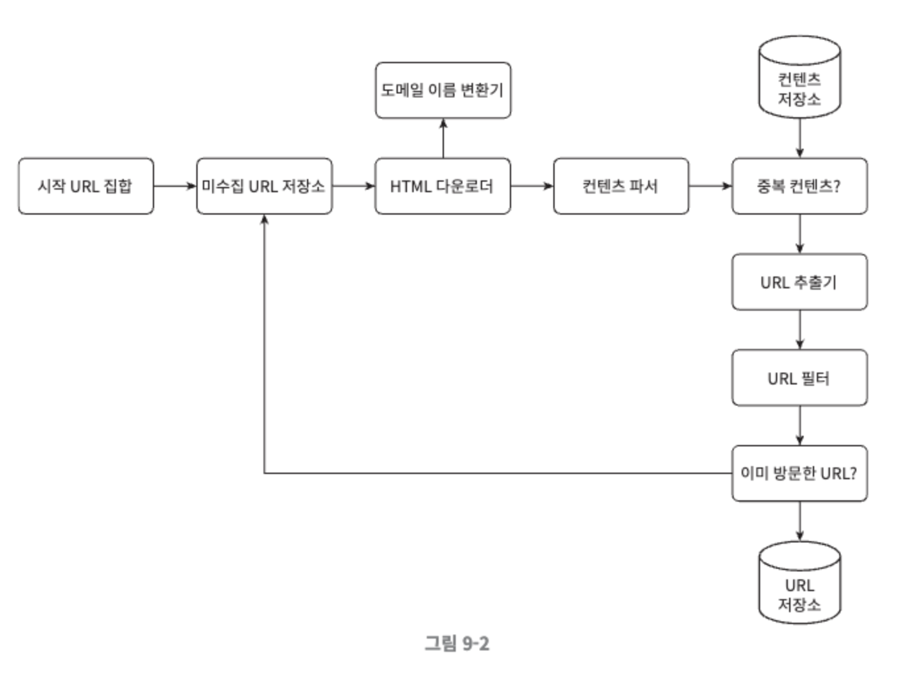
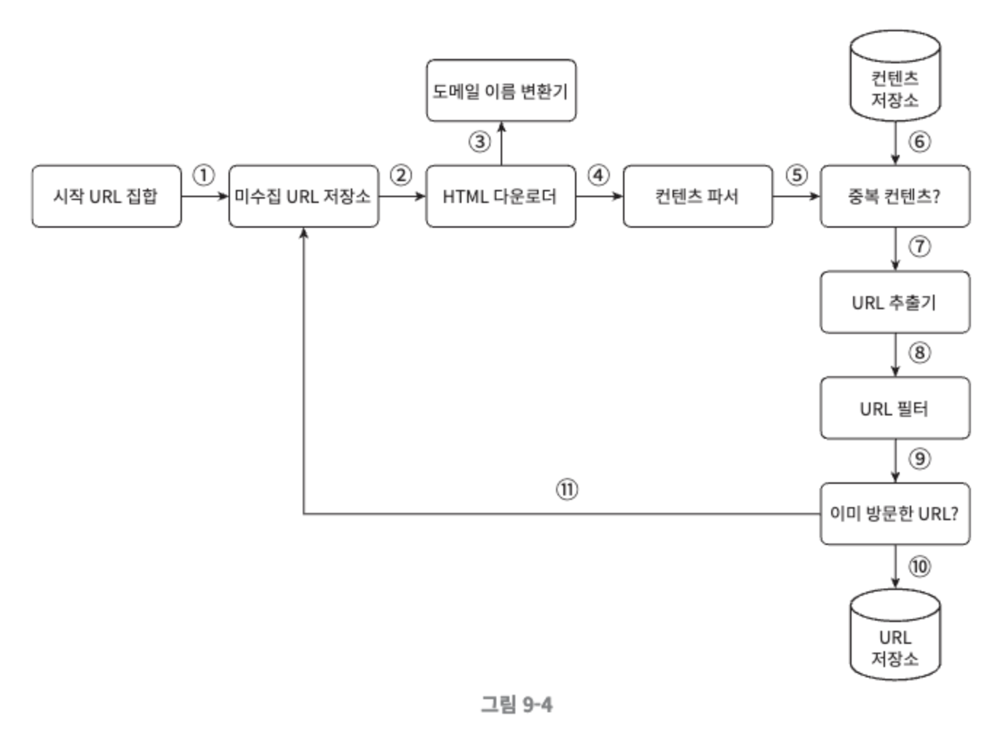
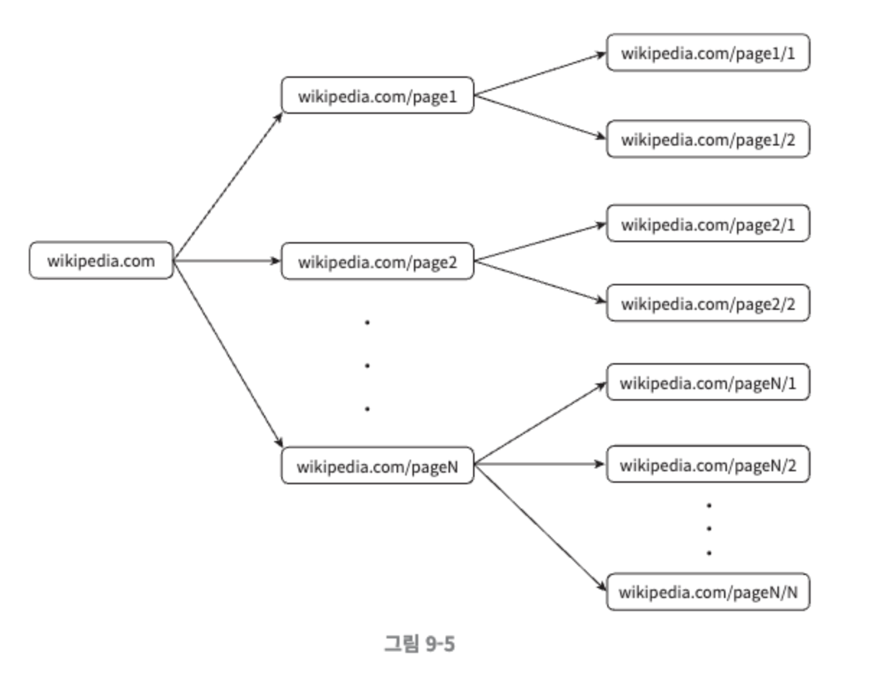
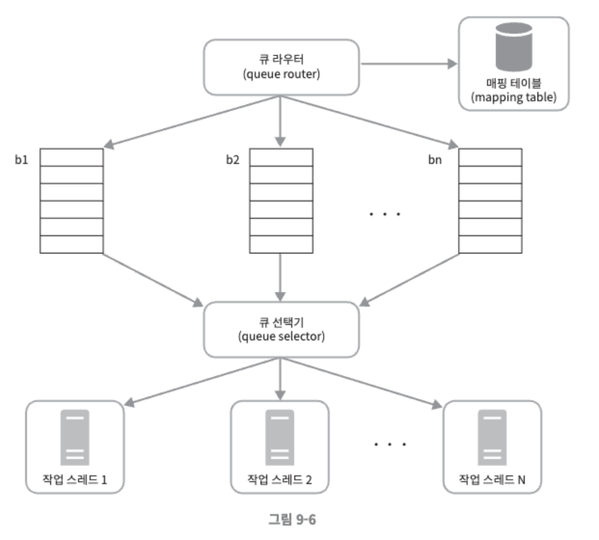
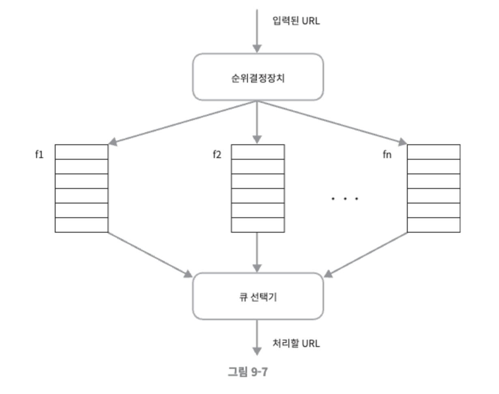
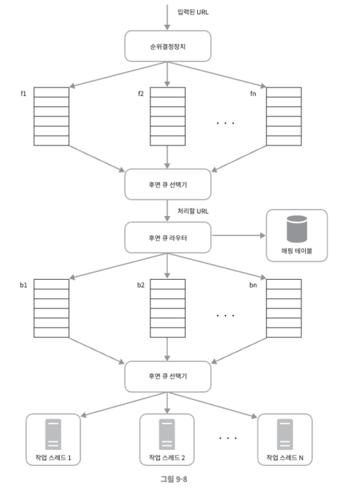
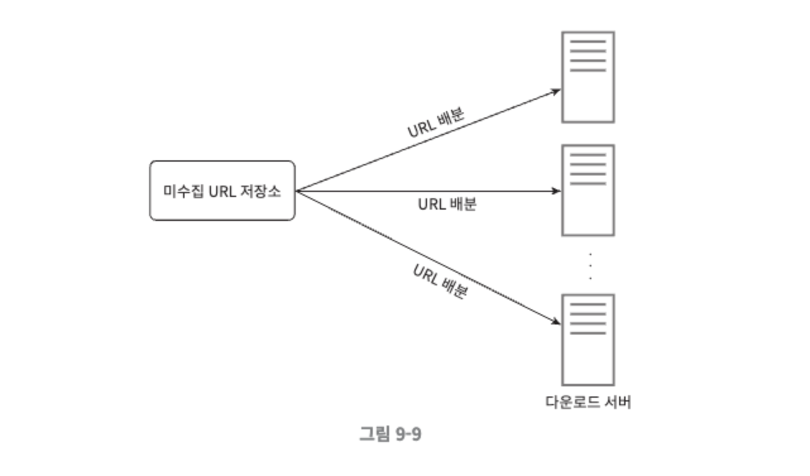
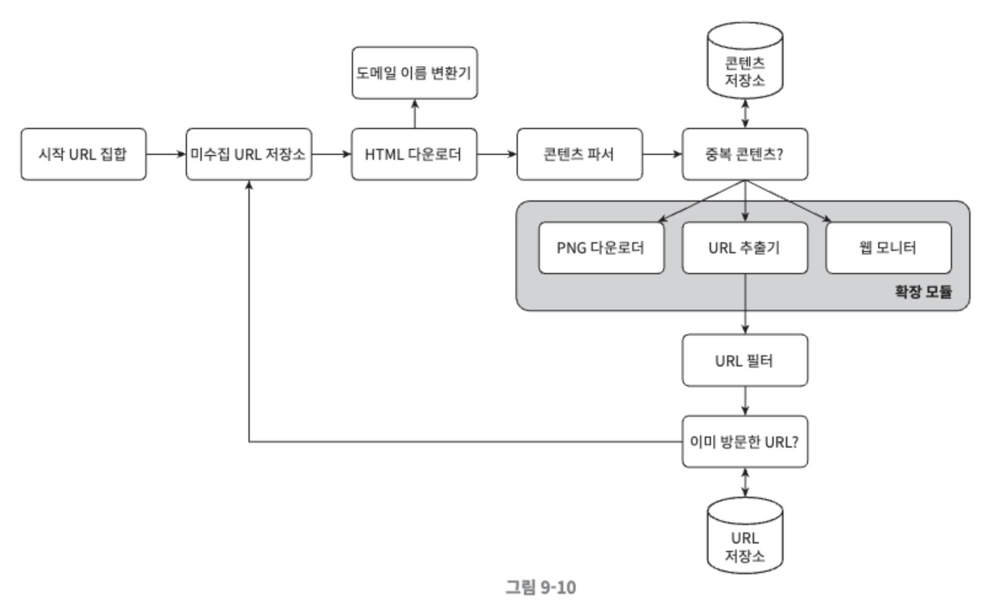

# 9장. 웹 크롤러 설계

 

웹 크롤러는 로봇 또는 스파이더 라고도 부른다. 검색엔진에서 널리 쓰는 기술로, 웹에 새로 올라오거나 갱신된 콘텐츠를 찾아내는 것이 주된 목적이다. 여기서 콘텐츠는 웹 페이지일 수도 있고, 이미지나 비디오, 또는 PDF 파일일 수도 있다. 웹 크롤러는 몇 개 웹페이지에서 시작하여 그 링크를 따라 나가면서 새로운 콘텐츠를 수집한다. 

크롤러는 다양하게 이용된다.

- 검색 엔진 인덱싱
    - 크롤러의 가장 보편적인 용례로, 크롤러는 웹 페이지를 모아 검색 엔진을 위한 로컬 인덱스를 만든다.
- 웹 아카이빙
    - 나중에 사용할 목적으로 장기보관하기 위해 웹에서 정보를 모으는 절차를 말한다. 많은 국립 도서관이 크롤러를 돌려 웹사이트를 아카이빙 하고있다.
- 웹 마이닝
    - 웹의 폭발적 성장세는 데이터 마이닝 업계에 전례없는 기회다. 웹 마이닝을 통해 인터넷에서 유용한 지식을 도출해 낼 수 있다. 유명 금융 기업들은 크롤러를 사용해 주주총회 자료나 연차 보고서를 다운받아 기업의 핵심 사업 방향을 알아내기도 한다.
- 웹 모니터링
    - 크롤러를 사용하면 인터넷에서 저작권이나 상표권이 침해되는 사례를 모니터링 할 수 있다.

 

웹 크롤러의 복잡도는 웹 크롤러가 처리해야 하는 데이터의 규모에 따라 달라지므로, 설계할 웹 크롤러가 감당해야 하는 데이터의 규모와 기능들을 알아내야만 한다.

  

## 1단계. 문제 이해 및 설계 범위 확정

웹 크롤러의 기본 알고리즘

- URL 집합이 입력으로 주어지면, 해당 URL들이 가리키는 모든 웹 페이지를 다운로드 한다.
- 다운받은 웹 페이지에서 URL 들을 추출한다.
- 추출된 URL들을 다운로드할 URL 목록에 추가하고 위의 과정을 처음부터 반복한다.

 

엄청난 규모 확장성을 갖는 웹 크롤러를 설계하는 것은 엄청나게 어려우며 주어진 시간안에 완성하기는 불가능할 것이므로, 설계를 진행하기 전에 질문을 던져서 요구사항을 알아내고 설계 범위를 좁힌다.

면접관과 크롤러 기능 요구사항을 명확히 하는 한편, 좋은 웹 크롤러가 만족시켜야 할 다음과 같은 속성에 주의를 기울인다.

- 규모 확장성
    - 웹은 거대하며 오늘날 웹에는 수십억 개의 페이지가 존재하기 때문에 병행을 활용하면 보다 효과적으로 웹 크롤링을 할 수 있을 것이다.
- 안정성
    - 웹은 잘못 작성된 HTML, 아무 반응이 없는 서버, 장애, 악성 코드가 붙어있는 링크 등이 가득하므로, 크롤러는 이런 비정상적 입력이나 환경에 잘 대응할 수 있어야 한다.
- 예절
    - 크롤러는 수집 대상 웹 사이트에 짧은 시간 동안 너무 많은 요청을 보내서는 안 된다.
- 확장성
    - 새로운 형태의 콘텐츠를 지원하기가 쉬워야 한다. 예를 들어, 이미지 파일도 크롤링이 필요할 경우 전체 시스템 설계를 새로 설계하는 경우는 없어야 한다.

   

### 개략적 규모 추정

- 매달 10억 개의 웹 페이지를 다운로드 한다.
- QPS=10djr(1billion, 즉 1,000,000,000)/30일/24시간/3600초 = 대략 400페이지/초
- 최대 QPS = 2 * QPS = 800
- 웹 페이지의 크기 평균은 500k 라고 가정
- 10억 페이지 * 500k = 500TB/월.
- 1개월치 데이터를 보관하는데는 500TB, 5년간 보관한다고 가정하면 결국 500TB * 12개월 * 5년 = 30PB 의 저장용량이 필요할 것이다.

   

## 2단계. 개략적 설계안 제시 및 동의 구하기

전체 웹을 크롤링해야 하는 경우에는 시작 URL을 고를 때 좀 더 창의적일 필요가 있다. 크롤러가 가능한 한 많은 링크를 탐색할 수 있도록 하는 URL을 고르는 것이 바람직하다.

일반적으로는 전체 URL 공간을 작은 부분집합으로 나누는 전략을 쓴다. 

- 지역적인 특색, 나라별로 인기 있는 웹 사이트가 다르다는 점에 착안한다.
- 예를 들어 URL 공간을 쇼핑, 스포츠, 건강 등등의 주제별로 세분화하고 그 각각에 다른 시작 URL을 쓰는 것이다. 시작 URL에 무엇을 쓸 것이냐는 정답이 없다.

 

### 미수집 URL 저장소

대부분의 현대적 웹 크롤러는 크롤링 상태를 (1) 다운로드할 URL, (2) 다운로드된 URL 두 가지로 나눠 관리한다.

‘다운로드할 URL’을 저장 관리하는 컴포넌트를 미수집 URL 저장소라고 부른다. FIFO 큐라고 생각하면 된다.

 

### HTML 다운로더

인터넷에서 웹 페이지를 다운로드하는 컴포넌트로, 다운로드할 페이지의 URL은 미수집 URL 저장소가 제공한다.

 

### 도메인 이름 변환기

HTML 다운로더는 도메인 이름 변환기를 사용하여 URL에 대응되는 IP 주소를 알아낸다. 

 

### 콘텐츠 파서

웹 페이지를 다운로드하면 파싱과 검증의 절차를 거쳐야 한다. 크롤링 서버 안에 콘텐츠 파서를 구현하면 크롤링 과정이 느려지게 될 수 있으므로, 독립된 컴포넌트로 만든다.

 

### 중복 콘텐츠 인가?

웹에 공개된 연구 결과에 따르면, 29% 가량의 웹 페이지 콘텐츠는 중복이다. 따라서 같은 콘텐츠를 여러 번 저장하게 될 수 있다. 본 설계안의 결우 이 문제를 해결하기 위한 자료 구조를 도입하여 데이터 중복을 줄이고 데이터 처리에 소요되는 시간을 줄인다. 

두 HTML 문서를 비교하는 가장 간단한 방법은 그 두 문서를 문자열로 보고 비교하는 것이겠지만, 비교 대상 문서의 수가 10억에 달하는 경우에는 느리고 비효율적이여서 적용하기 곤란하다. 효과적인 방법은 웹 페이지 해시 값을 비교하는 것이다.

 

### 콘텐츠 저장소

HTML 문서를 보관하는 시스템이다. 저장소를 구현하는 데 쓰일 기술을 고를 때는 저장할 데이터의 유형, 크기, 저장소 접근 빈도, 데이터의 유효 기간 등을 종합적으로 고려해야 한다. 본 설계안의 경우에는 디스크와 메모리를 동시에 사용하는 저장소를 택할 것이다.

- 데이터의 양이 너무 많으므로 대부분의 콘텐츠는 디스크에 저장한다.
- 인기 있는 콘텐츠는 메모리에 두어 접근 지연 시간을 줄인다.

 

### URL 추출기

HTML 페이지를 파싱하여 링크들을 골라내는 역할을 한다. 상대경로는 전부 절대 경로로 변환한다.

  

### URL 필터

특정한 콘텐츠 타입이나 파일 확장자를 갖는 URL, 접속 시 오류가 발생하는 URL, 접근 제외 목록에 포함된 URL 등을 크롤링 대상에서 배제하는 역할을 한다.

  

### 이미 방문한 URL?

이 단계 구현을 위해 이미 방문한 URL이나 미수집 URL 저장소에 보관된 URL을 추적할 수 있도록 하는 자료 구조를 사용한다. 이미 방문한 적이 있는 URL인지 추적하면 같은 URL을 여러 번 처리하는 일을 방지할 수 있으므로 서버 부하를 줄이고 시스템이 무한 루프에 빠지는 일을 방지할 수 있다.

해당 자료 구조로는 블룸 필터나 해시 테이블이 널리 쓰인다. 

 

### URL 저장소

이미 방문한 URL을 보관하는 저장소

  

### 웹 클롤러 작업 흐름

- 시작 URL들을 미수집 URL 저장소에 수집한다.
- HTML 다운로더는 미수집 URL 저장소에서 URL 목록을 가져온다.
- HTML 다운로더는 도메인 이름 변환기를 사용하여 URL의 IP 주소를 알아내고, 해당 IP 주소로 접속하여 웹 페이지를 다운받는다.
- 콘텐츠 파서는 다운된 HTML 페이지를 파싱하여 올바른 형식을 갖춘 페이지인지 검증한다.
- 콘텐츠 파싱과 검증이 끝나면 중복 콘텐츠인지 확인하는 절차를 개시한다.
- 중복 콘텐츠인지 확인하기 위해서, 해당 페이지가 이미 저장소에 있는지 본다.
    - 이미 저장소에 있는 콘텐츠인 경우에는 처리하지 않고 버린다.
    - 저장소에 없는 콘텐츠인 경우에는 저장소에 저장한 뒤 URL 추출기로 전달한다.
- URL 추출기는 해당 HTML 페이지에서 링크를 골라낸다.
- 골라낸 링크를 URL 필터로 전달한다.
- 필터링이 끝나고 남은 URL만 중복 URL 판별 단계로 전달한다.
- 이미 처리한 URL인지 확인하기 위하여, URL 저장소에 보관된 URL인지 살핀다. 이미 저장소에 있는 URL은 버린다.
- 저장소에 없는 URL은 URL 저장소에 저장할 뿐 아니라 미수집 URL 저장소에도 전달한다.

   

## 3단계. 상세 설계

지금까지 개략적 설계안을 살펴보았고, 컴포넌트와 구현 기술을 살펴본다

- DFS vs BFS
- 미수집 URL 저장소
- HTML 다운로더
- 안정성 확보 전략
- 확장성 확보 전략
- 문제 있는 콘텐츠 감지 및 회피 전략

  

### DFS를 쓸 것인가 BFS를 쓸 것인가

웹은 유향 그래프와 같다. 페이지는 노드이고, 하이퍼링크는 에지라고 본다. 크롤링 프로세스는 이 유향 그래프를 에지에 따라 탐색하는 과정이다.

  

DFS, 깊이 우선 탐색법은 그래프 크기가 클 경우 어느 정도로 깊숙이 가게 될지 가늠하기 어렵기 때문에 좋은 선택이 아닐 가능성이 높다.

웹 크롤러는 보통 BFS, 너비 우선 탐색법을 사용한다. BFS는 FIFO 큐를 사용하는 알고리즘이다. 이 큐의 한쪽으로는 탐색할 URL을 집어넣고, 다른 한쪽으로는 꺼내기만 한다. 이 구현법에는 두 가지 문제점이 있다.

- 한 페이지에서 나오는 링크의 상당수는 같은 서버로 되돌아간다.
    - 9-5의 예시로 볼때, [wikipedia.com](http://wikipedia.com) 페이지에서 추출한 모든 링크는 내부 링크, 즉 동일한 wikipedia.com 서버의 다른 페이지를 참조하는 링크로, 결국 크롤러는 같은 호스트에 속한 많은 링크를 다운받느라 바빠지게 된다. 이때 링크들을 병렬로 처리하게 된다면 위키피디아 서버는 수많은 요청으로 과부하게 걸리게 될 것이다. → ‘예의 없는’ 크롤러

- 표준적 BFS 알고리즘은 URL 간에 우선순위를 두지 않는다.  → 처리 순서에 있어 모든 페이지를 공평하게 대우한다.
    - 하지만 모든 웹 페이지가 같은 수준의 품질, 같은 수준의 중요성을 갖지는 않기 때문에 페이지 순위, 사용자 트래픽 양, 업데이트 빈도 등 여러 가지 척도에 비추어 처리 우선순위를 구별해야 한다.

  

### 미수집 URL 저장소

미수집 저장소를 활용하여 이런 문제를 해결할 수 있다. 미수집 URL 저장소는 다운로드할 URL을 보관하는 장소로, 이 저장소를 잘 구현하면 ‘예의(politeness)’를 갖춘 크롤러, URL 사이의 우선순위와 신선도(freshness)를 구별하는 크롤러를 구현할 수 있다. 미수집 URL 저장소를 구현하는 방법의 논문을 요약하면 다음과 같다.

  

**예의**

웹 크롤러는 수집 대상 서버로 짧은 시간 안에 너무 많은 요청을 보내는 것을 삼가야 한다. 

- 너무 많은 요청을 보내는 것은 ‘무례한(impolite)’ 일이며, 때로는 DoS(Denial-of-Service) 공격으로 간주되기도 한다.
- 아무 안전장치가 없는 웹 크롤러의 경우, 초당 수천 건의 페이지 요청을 동일한 웹 사이트로 보내어 사이트를 마비시켜버릴 수도 있다.

 

예의 바른 크롤러를 만드는 데 있어서 지켜야 할 한 가지 원칙 

> 동일 웹 사이트에 대해서는 한 번에 한 페이지만 요청한다
> 

같은 웹 사이트의 페이지를 다운받는 태스크는 시간차를 두고 실행하도록 한다. 이 요구사항을 만족시키려면 웹사이트의 호스트명과 다운로드를 수행하는 작업스레드 사이의 관계를 유지하면 된다. 즉, 각 다운로드 스레드는 별도 FIFO 큐를 가지고 있어서, 해당 큐에서 꺼낸 URL만 다운로드 한다.

- 큐 선택기
    - 큐 선택기는 큐들을 순회하면서 큐에서 URL을 꺼내 해당 큐에서 나온 URL을 다운로드하도록 지정된 작업 스레드에 전달하는 역할을 한다.
- 작업 스레드
    - 작업 스레드는 전달된 URL을 다운로드하는 작업을 수행한다. 전달된 URL은 순차적으로 처리될 것이며, 작업들 사이에는 일정한 지연시간을 둘 수 있다.

  

**우선순위**

유용성에 따라 URL의 우선순위를 나눌 때는 페이지랭크(PageRank), 트래픽 양, 갱신 빈도 등 다양한 척도를 사용할 수 있을 것이다. 본 절에서 설명할 순위결정장치(prioritizer)는 URL 우선순위를 정하는 컴포넌트이다.

URL 우선순위를 고려하여 변경한 설계는 다음과 같다.

- 순위결정장치(prioritizer)
    - URL을 입력으로 받아 우선순위를 계산한다.
- 큐(f1,…fn)
    - 우선순위별로 큐가 하나씩 할당된다. 우선순위가 높으면 선택될 확률도 올라간다.
- 큐 선택기
    - 임의 큐에서 처리할 URL을 꺼내는 역할을 담당한다. 순위가 높은 큐에서 더 자주 꺼내도록 프로그램되어 있다.

 

그림 9-8은 이를 반영한 전체 설계이다. 아래의 두 개 모듈이 존재하는 걸 볼 수 있다.

- 전면 큐(front queue) : 우선순위 결정 과정을 처리한다.
- 후면 큐(back queue) : 크롤러가 예의 바르게 동작하도록 보증한다.

  

**신선도**

웹 페이지는 수시로 추가,삭제,변경 되는데 데이터 신선함을 유지하기 위해서는 이미 다운로드한 페이지라고 해도 주기적으로 재수집할 필요가 있다. 모든 URL을 재수집 하는 것은 많은 시간과 자원이 필요한 작업이므로 최적화하기 위해 다음의 전략을 사용할 수 있다.

- 웹 페이지의 변경 이력(update history) 활용

  

**미수집 URL 저장소를 위한 지속성 저장장치**

검색 엔진을 위한 크롤러의 경우 처리해야 하는 URL 수는 수억개에 달한다.

- 그 모두를 메모리에 보관하는 것은 안정성이나 규모 확장성 측면에서 바람직하지 않다.
- 하지만 전부 디스크에 저장하는 것도 쉽게 성능 병목지점이 되므로 좋은 방법은 아니다.

본 설계안은 절충안으로 대부분의 URL은 디스크에 두지만 IO 비용을 줄이기 위해 메모리 버퍼에 큐를 둔다. 버퍼에 있는 데이터는 주기적으로 디스크에 기록할 것이다.

   

### HTML 다운로더

HTML 다운로더는 HTTP 프로토콜을 통해 웹 페이지를 내려받는다. 

 

**Robots.txt**

- 로봇 제외 프로토콜이라고 부르기도 하는 Robots.txt는 웹사이트가 크롤러와 소통하는 표준적 방법이다.
- 이 파일에는 크롤러가 수집해도 되는 페이지 목록이 들어있는데, 웹 사이트를 긁어 가기 전에 크롤러는 해당 파일에 나열된 규칙을 먼저 확인해야 한다.
- Robots.txt 파일을 거푸 다운로드하는 것을 피하기 위해 이 파일은 주기적으로 다시 다운받아 캐시에 보관한다.

  

**성능 최적화**

다음은 HTML 다운로더에 사용할 수 있는 성능 최적화 기법들이다.

 

- 분산 크롤링
    - 성능을 높이기 위해 크롤링 작업을 여러 서버에 분산하는 방법으로, 각 서버는 여러 스레드를 돌려 다운로드 작업을 처리한다.
    - 이 구성을 위해 URL 공간을 작은 단위로 분할하여, 각 서버는 그중 일부의 다운로드를 담당하도록 하는데, 다음처럼 최적화한 사례를 보여준다.
        
        
        
- 도메인 이름 변환 결과 캐시
    - 도메인 이름 변환기(DNS Resolver)는 크롤러 성능의 병목 중 하나인데, 이는 DNS 요청을 보내고 결과를 받는 작업의 동기적 특성 때문이다.
        - DNS 요청의 결과를 받기 전까지는 다음 작업을 진행할 수 없다. DNS 요청이 처리 되는 데는 보통 10ms 에서 200ms 가 소요된다.
        - 크롤러 스레드 가운데 어느 하나라도 이 작업을 하고 있으면 다른 스레드의 DNS 요청은 전부 블록된다.
    - 따라서 DNS 조회 결과로 얻어진 도메인 이름과 IP 주소 사이의 관계를 캐시에 보관해 놓고 크론 잡(cron job) 등을 돌려 주기적으로 갱신하도록 해 놓으면 성능을 효과적으로 높일 수 있다.

 

- 지역성
    - 크롤링 작업을 수행하는 서버를 지역별로 분산하는 방법이다.
    - 크롤링 서버가 대상 서버와 지역적으로 가까우면 페이지 다운로드 시간은 줄어들 것이다.
    - 지역성을 활용하는 전략은 크롤 서버, 캐시, 큐, 저장소 등 대부분의 컴포넌트에 적용 가능하다.

 

- 짧은 타임아웃
    - 응답을 기다리는 대기시간이 길면 좋지 않기 때문에 최대 limit를 정해둔다. 이 시간 동안 서버가 응답하지 않으면 크롤러는 해당 페이지 다운로드를 중단하고 다음 페이지로 넘어간다.

  

**안정성**

시스템 안정성을 향상시키기 위한 접근법 가운데 중요한 몇 가지는 다음과 같다.

- 안정 해시
    - 다운로더 서버들에 부하를 분산할 때 적용 가능한 기술이다.
    - 이 기술을 이용하면 다운로더 서버를 쉽게 추가하고 삭제 할 수 있다.
- 크롤링 상태 및 수집 데이터 저장
    - 장애가 발생한 경우에도 쉽게 복구할 수 있도록 크롤링 상태와 수집된 데이터를 지속적 저장장치에 기록해 둔다. 저장된 데이터를 로딩하고 나면 중단되었던 크롤링을 쉽게 재시작 할 수 있을 것이다.
- 예외 처리
    - 대규모 시스템에서는 예외가 발생해도 전체 시스템이 중단되는 일 없이 그 작업을 우아하게 이어나갈 수 있어야 한다.
- 데이터 검증
    - 시스템 오류를 방지하기 위한 중요 수단 가운데 하나다.

  

**확장성**

이런 시스템을 설계할 때는 새로운 형식의 콘텐츠를 쉽게 지원할 수 있도록 신경 써야 한다. 

본 예제의 경우 새로운 모듈을 끼워 넣음으로써 새로운 형태의 콘텐츠를 지원할 수 있도록 설계 하였다.

- PNG 다운로더는 PNG 파일을 다운로드하는 플러그인 모듈이다.
- 웹 모니터는 웹을 모니터링하여 저작권이나 상표권이 침해되는 일을 막는 모듈이다.

  

**문제 있는 콘텐츠 감지 및 회피**

중복이거나 의미 없는, 또는 유해한 콘텐츠를 어떻게 감지하고 시스템으로부터 차단할지 살펴본다.

- 중복 콘텐츠
    - 웹 콘텐츠의 30% 가량은 중복으로, 해시나 체크섬을 이용하면 중복 콘텐츠를 보다 쉽게 탐지할 수 있다.
- 거미 덫
    - 크롤러를 무한 루프에 빠뜨리도록 설계한 웹 페이지
        - 예) 무한히 깊은 디렉터리 구조를 포함하는 링크가 존재
            - spidertrapexample.com/foo/bar/foo/bar/foo/bar/…..
        - 이런 덫은 URL의 최대 길이를 제한하면 회피할 수 있다.
    - 모든 종류의 덫을 피할 수 있는 만능 해결책은 없지만, 이런 덫이 설치된 웹 사이트인지 알아내는 것은 쉽다.
        - 기이할 정도로 많은 웹 페이지를 가지고 있는 것이 일반적이다.
    - 하지만 덫을 자동으로 피해가는 알고리즘을 만들어내는 것은 까다로우며, 한 가지 방법으로 사람이 수작업으로 덫을 확인하고 찾아낸 후에 덫이 있는 사이트를 크롤러 탐색 대상에서 제외하거나 URL 필터 목록에 걸어두는 것이다.
- 데이터 노이즈
    - 어떤 콘텐츠는 광고나 스크립트 코드, 스팸 URL 같은 것으로 가치가 없다. 이런 콘텐츠는 가능하다면 제외해야 한다.

   

## 4단계. 마무리

이번 장에서 좋은 크롤러가 갖추어야 하는 특성을 살펴보았다. 

> 규모 확장성, 예의, 확장성, 안정성
> 

아울러 크롤러의 설계안을 제시하고, 핵심 컴포넌트에 쓰이는 기술들을 살펴보았다. 

웹이 워낙 방대하고 수없이 많은 덫이 도사리고 있기 때문에 규모 확장성이 뛰어난 웹 크롤러 설계 작업은 단순하지 않다. 추가적으로 다음과 같은 주제를 논의해보면 좋다.

- 서버 측 렌더링
    - 많은 웹사이트가 자바스크립트, AJAX 등의 기술을 통해서 링크를 즉석으로 만들어내지만 웹 페이지를 다운받아 파싱해보면 동적으로 생성되는 링크는 발견할 수 없다. 이 문제는 페이지를 파싱하기 전에 서버 측 렌더링을 적용하면 해결할 수 있다.
- 원치 않는 페이지 필터링
    - 저장 공간 등 크롤링에 소요되는 자원은 유한하기 때문에 스팸 방지 컴포넌트를 두어 조악하거나 스팸성인 페이지를 걸러내도록 해 두면 좋다.
- 데이터베이스 다중화 및 샤딩
    - 다중화나 샤딩같은 기법을 적용하면 데이터 계층의 가용성, 규모 확장성, 안정성이 향상된다.
- 수평적 규모 확장성
    - 대규모의 크롤링을 위해서는 다운로드를 실행할 서버가 수백 혹은 수천 대 필요하게 될 수도 있다. 수평적 규모 확장성을 달성하는 데 중요한 것은 서버가 상태정보를 유지하지 않도록 하는 것 즉 무상태 서버로 만드는 것이다.
- 가용성, 일관성, 안정성
    - 위 개념들은 성공적인 대형 시스템을 만들기 위해 필수적으로 고려해야 하는 것들이다.
- 데이터 분석 솔루션
    - 시스템을 세밀히 조정하기 위해서는 이런 데이터와 그 분석 결과가 필수적이기 때문에 데이터를 수집하고 분석하는 것은 어느 시스템에게나 중요하다.