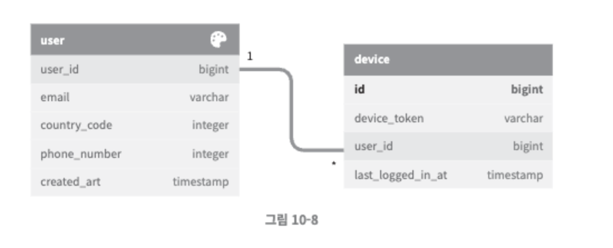
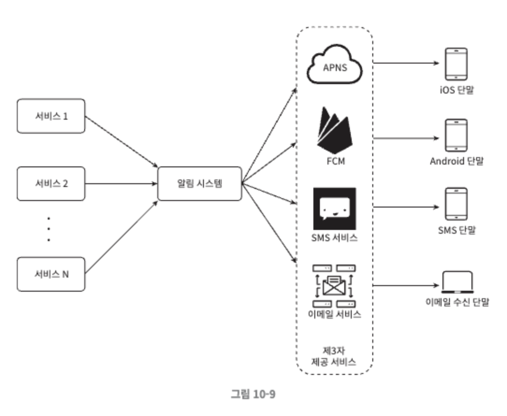
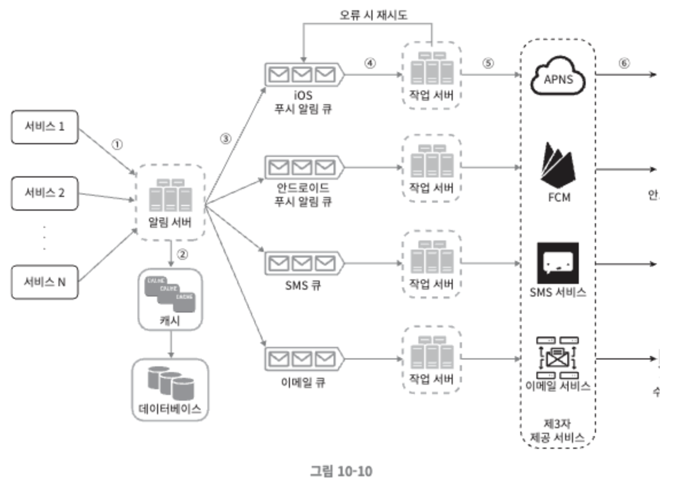
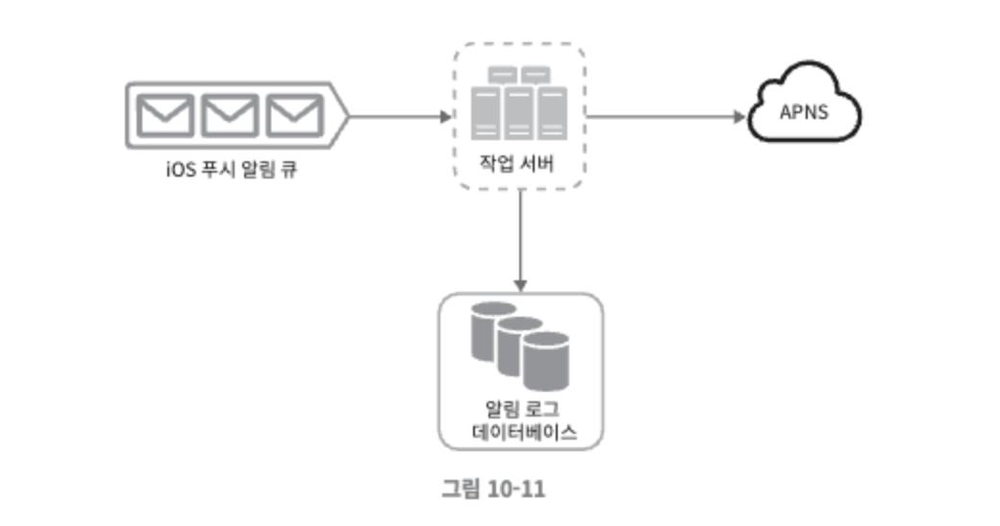
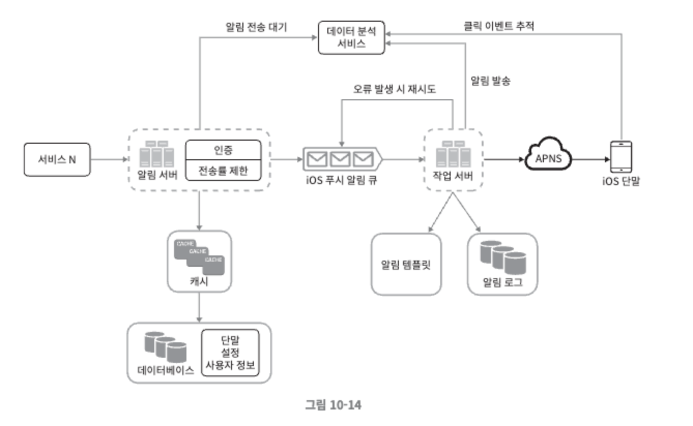

# 10장. 알림 시스템 설계

알림 기능을 갖춘 애플리케이션 프로그램은 최신 뉴스, 제품 업데이트, 이벤트, 선물 등 고객에게 중요할 만한 정보를 비동기적으로 제공한다. 

알림 시스템은 모바일 푸시 알림, SMS 메시지, 이메일 의 세 가지로 분류할 수 있다.

   

## 1단계. 문제 이해 및 설계 범위 확정

하루에 백만 건 이상의 알림을 처리하는 확장성 높은 시스템을 구축하는 것은 알림 시스템이 어떻게 구현되는지에 대한 깊은 이해가 필요한 작업이다. 이에 관한 문제가 면접에 출제될 때는 보통 정해진 답이 없고 문제 자체가 모호하게 주어지는 것이 일반적이므로, 적절한 질문을 통해 요구사항이 무엇인지 스스로 알아내야 한다.

### 요구사항 정리

- 푸시알림, SMS 메시지, 이메일
- 연성 실시간 시스템. 가능한 한 빨리 전달되어야 하지만 시스템에 높은 부하가 걸렸을 때 약간의 지연 허용
- iOS 단말, 안드로이드 단말, 랩톱/데스크톱 지원
- 알림은 클라이언트 애플리케이션이 만들거나 서버 측에서 스케줄링하여 생성
- 사용자는 알림을 받지 않도록 설정할 수 있음
- 하루에 천만 건의 모바일 푸시 알림, 백만 건의 SMS 메시지, 5백만 건의 이메일을 보낼 수 있어야 함.

   

## 2단계. 개략적 설계안 제시 및 동의 구하기

이번 장에서는 다음과 같은 내용을 다룬다.

- 알림 유형별 지원 방안
- 연락처 정보 수집 절차
- 알림 전송 및 수신 절차

  

### 알림 유형별 지원 방안

각각의 알림 메커니즘이 어떻게 동작하는지 알아본다.

 

**iOS 푸시 알림**

iOS에서 푸시 알림을 보내기 위해서는 세 가지 컴포넌트가 필요하다.

- 알림 제공자(provider)
    - 알림 요청을 만들어 애플 푸시 알림 서비스(APNS)로 보내는 주체
    - 알림 요청을 만들려면 다음과 같은 데이터가 필요하다.
        - 단말 토큰 : 알림 요청을 보내는 데 필요한 고유 식별자
        - 페이로드 : 알림 내용을 담은 JSON 딕셔너리
- APNS
    - 애플이 제공하는 원격 서비스
    - 푸시 알림을 iOS 장치로 보내는 역할을 담당한다.
- iOS 단말
    - 푸시 알림을 수신하는 사용자 단말

 

**안드로이드 푸시 알림**

안드로이드 푸시 알림도 비슷한 절차로 전송되며, APNS 대신 FCM(Firebase Cloud Messaging)을 사용한다.

 

**SMS 메시지**

SMS 메시지를 보낼때는 보통 트윌리오, 넥스모와 같은 제 3사업자의 서비스를 많이 이용한다. 이런 서비는 대부분 상용 서비스라서 이용 요금을 내야한다.

 

**이메일**

대부분의 회사는 고유 이메일 서버를 구축할 역량을 갖추고 있음에도 많은 회사가 상용 이메일 서비스를 이용한다. 

유명한 서비스로 샌드그리드, 메일침프가 있는데 전송 성공률도 높고, 데이터 분석 서비스도 제공한다.

  

### 연락처 정보 수집 절차

알림을 보내려면 모바일 단말 토큰, 전화번호, 이메일 주소 등의 정보가 필요하다. 사용자가 우리 앱을 설치하거나 처음으로 계정을 등록하면 API 서버는 해당 사용자의 정보를 수집하여 데이터베이스에 저장한다.

데이터 베이스에 연락처 정보를 저장할 테이블 구조는 10-8과 같다. 필수 정보만 담은 설계안이다.

- 이메일 주소와 전화번호는 user 테이블에, 단말 토큰은 device 테이블에 저장한다.
- 한 사용자가 여러 단말을 가질 수 있고, 알림은 모든 단말에 전송되어야 한다는 점을 고려햐였다.

  

### 알림 전송 및 수신 절차

**개략적 설계안(초안)**

- 1부터 N까지의 서비스
    - 서비스 각각은 마이크로서비스, 크론잡, 분산 시스템 컴포넌트 일 수도 있다.
- 알림 시스템
    - 알림 전송/수신 처리의 핵심으로, 우선 1개 서버만 사용하는 시스템이라고 가정한다.
    - 시스템은 서비스 1~N에 알림 전송을 위한 API 제공, 제 3자 서비스에 전달할 페이로드 생성이 필요하다.
- 제 3자 서비스
    - 사용자에게 알림을 실제로 전달하는 역할
    - 쉽게 새로운 서비스를 통합하거나 기존 서비스를 제거할 수 있도록 확장성을 고려해야한다.
    - 특정 서비스는 다른 시장에서는 사용할 수 없을수도 있다 ( 국가적 문제..)
- iOS, 안드로이드, SMS, 이메일 단말
    - 사용자는 자기 단말에서 알림을 수신한다.

 

> 위 설계에는 몇 가지 문제가 있다.
> 
- SPOF : 알림 서비스에 서버가 하나밖에 없어 SPOF의 위험이 존재한다.
- 규모확장성 : 한 대 서비스로 푸시알림에 관계된 모든 것을 처리하므로 DB나 캐시 등 주요 컴포넌트의 규모를 개별적으로 늘리기 어렵다.
- 성능 병목 : 사용자 트래픽이 많이 몰릴 경우 시스템이 과부하 상태에 빠질 수 있다.

 

**개략적 설계안 (개선된 버전)**

- 데이터베이스와 캐시를 알림 시스템의 주 서버에서 분리
- 알림 서버 증설 → 수평적 규모 확장
- 메시지 큐를 이용해 시스템 컴포넌트 사이의 결합을 끊음

- 알림 서버
    - 알림 전송 API : 스팸 방지를 위해 보통 사내 서비스 또는 인증된 클라이언트만 이용 가능
    - 알림 검증 : 이메일 주소, 전화번호 등에 대한 기본적 검증을 수행
    - 데이터베이스 또는 캐시 질의 : 알림에 포함시킬 데이터를 가져오는 기능
    - 알림 전송 : 알림 데이터를 메시지 큐에 넣는다.
- 캐시
    - 사용자 정보, 단말 정보, 알림 템플릿 등을 캐시
- 데이터 베이스
    - 사용자, 알림, 설정 등 다양한 정보 저장
- 메시지 큐
    - 시스템 컴포넌트 간 의존성을 제거하기 위해 사용
    - 다량의 알림이 전송되어야 하는 경우를 대비한 버퍼 역할
    - 본 설계안에서는 알림의 종류별로 별도 메시지 큐를 사용하여 제 3자 서비스 가운데 하나에 장애가 발생해도 다른 종류의 알림은 정상 동작한다.
- 작업 서버
    - 메시지 큐에서 전송할 알림을 꺼내서 제3자 서비스로 전달하는 역할을 담당하는 서버

 

**알림 전송 작업 흐름**

- API를 호출하여 알림 서버로 알림을 보낸다.
- 알림 서버는 사용자 정보, 단말 토큰, 알림 설정 같은 메타데이터를 캐시나 데이터베이스에서 가져온다.
- 알림 서버는 전송할 알림에 맞는 이벤트를 만들어서 해당 이벤트를 위한 큐에 넣는다.
- 작업 서버는 메시지 큐에서 알림 이벤트를 꺼낸다.
- 작업 서버는 알림을 제3자 서비스로 보낸다.
- 제3자 서비스는 사용자 단말로 알림을 전송한다.

## 3단계. 상세 설계

### 안정성

분산 환경에서 운영될 알림 시스템을 설계할 때는 안정성을 확보하기 위한 사항 몇 가지를 반드시 고려한다.

 

**데이터 손실 방지**

- 알림 전송 시스템의 가장 중요한 요구사항 가운데 하나는 알림이 손실되지 않는 것이다.
- 이 요구사항을 만족하기 위해 알림 시스템은 알림 데이터를 데이터베이스에 보관하고 재시도 메커니즘을 구현해야 한다.
- 그림 10-11과 같이 알림 로그 데이터베이스를 유지하는 것이 한 가지 방법이다

 

**알림 중복 전송 방지**

대부분의 경우 알림은 딱 한번만 전송되지만, 분산 시스템의 특성상 가끔 같은 알림이 중복되어 전송되기도 할 것이다. 그 빈도를 줄이기 위해 중복을 탐지하는 메커니즘을 도입하고 오류를 신중하게 처리한다.

- 보내야 할 알림이 도착하면 그 이벤트를 ID를 검사하여 이전에 본 적이 있는 이벤트인지 살핀다.
- 중복된 이벤트라면 버리고, 그렇지 않으면 알림을 발송한다.

  

### 추가로 필요한 컴포넌트 및 고려사항

**알림 템플릿**

- 알림 메시지 대부분은 형식이 비슷하며, 알림 템플릿은 이런 유사성을 고려하여 알림 메시지의 모든 부분을 처음부터 다시 만들 필요 없도록 해 준다.
- 알림 템플릿은 인자나 스타일, 추적 링크를 조정하기만 하면 사전에 지정한 형식에 맞춰 알림을 만들어 내는 틀이다.
- 템플릿을 사용하면 전송될 알림들의 형식을 일관성 있게 유지할 수 있고, 오류 가능성뿐 아니라 알림 작성에 드는 시간도 줄일 수 있다.

 

**알림 설정**

- 알림의 빈도에 따라 사용자가 피곤함을 느낄 수 있기 때문에 사용자가 알림 설정을 상세히 조정할 수 있도록 한다.
- 이 정보는 알림 설정 테이블에 보관되며, 다음과 같은 필드가 필요할 수 있다.
    - user_id : bigint
    - channel : varchar   # 알림이 전송될 채널, 푸시 알림, 이메일, SMS 등
    - opt_in : boolean   # 해당 채널로 알림을 받을 것인지의 여부

 

**전송률 제한**

사용자가 받을 수 있는 알림의 빈도를 제한한다.

 

**재시도 방법**

제3자 서비스가 알림 전송에 실패하면, 해당 알림을 재시도 전용 큐에 넣는다. 

 

**푸시 알림과 보안**

- iOS과 안드로이드의 앱의 경우, 알림 전송 API는 appKey와 appSecret을 사용하여 보안을 유지한다.
- 따라서 인증된 혹은 승인된 클라이언트만 해당 API를 사용하여 알림을 보낼 수 있다.

 

**큐 모니터링**

- 알림 시스템을 모니터링 할 때 중요한 메트릭 하나는 큐에 쌓인 알림의 개수이다.
    - 이 수가 너무 크면 작업 서버들이 이벤트를 빠르게 처리하고 있지 못하다는 뜻으로, 작업 서버를 증설할 필요가 있다.

 

**이벤트 추적**

알림 확인율, 클릭율, 실제 앱 사용으로 이어지는 비율 등의 메트릭은 사용자를 이해하는 데 중요하다.

데이터 분석 서비스는 보통 이벤트 추적 기능도 제공하기 때문에 알림 시스템을 만들면 데이터 분석 서비스와도 통합해야만 한다. 

  

### 수정된 설계안

현재까지의 내용을 모두 반영하여 수정한 설계안은 다음과 같다.

- 알림 서버에 인증과 전송률 제한 기능이 추가되었다.
- 전송 실패에 대응하기 위한 재시도 기능이 추가되었다.
- 전송에 실패한 알림은 다시 큐에 넣고 지정된 횟수만큼 재시도한다.
- 전송 템플릿을 사용하여 알림 생성 과정을 단순화하고 알림 내용의 일관성을 유지한다.
- 모니터링과 추적 시스템을 추가하여 시스템 상태를 확인하고 추후 시스템을 개선하기 쉽도록 하였다.

   

## 4단계. 마무리

이번 장에서 우리는 규모 확장이 쉬울 뿐 아니라 푸시 알림, SMS 메시지, 이메일 등 다양한 정보 전달 방식을 지원하는 알림 시스템을 만들었다. 시스템 컴포넌트 사이의 결합도를 낮추기 위해 메시지 큐를 적극적으로 사용하였다.

개략적 설계안과 더불어 각 컴포넌트의 구현 방법과 최적화 기법에 대해서도 알아보았으며 아래 주제에 집중하였다.

- 안정성
    - 메시지 전송 실패율을 낮추기 위해 안정적인 재시도 메커니즘을 도입하였다.
- 보안
    - 인증된 클라이언트만이 알림을 보낼 수 있도록 appKey, appSecret 등의 메커니즘을 이용하였다.
- 이벤트 추적 및 모니터링
    - 알림이 만들어진 후 성공적으로 전송되기까지의 과정을 추적하고 시스템 상태를 모니터링 할 수 있는 시스템을 통합하였다.
- 사용자 설정
    - 사용자가 알림 수신 설정을 조정할 수 있도록 하여 알림을 보내기 전 반드시 해당 설정을 확인하도록 시스템 설계를 변경하였다.
- 전송률 제한
    - 사용자에게 알림을 보내는 빈도를 제한할 수 있도록 하였다.