# 13장. 검색어 자동완성 시스템

가장 많이 이용된 검색어 k개를 자동완성하여 출력하는 시스템을 설계한다.

</br></br>

## 1단계. 문제 이해 및 설계 범위 확정

### 요구 사항 정리

- 빠른 응답 속도
    - 사용자가 검색어를 입력함에 따라 자동완성 검색어도 충분히 빨리 표시되어야 한다. 페이스북 검색어 자동완성 시스템에 관한 문서를 보면 시스템 응답속도는 100밀리초 이내여야 한다. 그렇지 않으면 시스템 이용이 불편해진다.
- 연관성
    - 자동완성되어 출력되는 검색어는 사용자가 입력한 단어와 연관된 것이여야 한다.
- 정렬
    - 시스템의 계산 결과는 인기도 등의 순위 모델에 의해 정렬되어 있어야 한다.
- 규모 확장성
    - 시스템은 많은 트래픽을 감당할 수 있도록 확장 가능해야 한다.
- 고가용성
    - 시스템의 일부에 장애가 발생하거나, 느려지거나, 예상치 못한 네트워크 문제가 생겨도 시스템은 계속 사용 가능해야 한다.

</br></br>

### 개략적 규모 추정

- 일간 능동 사용자(DAU)는 천만 명으로 가정한다.
- 평균적으로 한 사용자는 매일 10건의 검색을 수행한다고 가정한다.
- 질의할 때마다 평균적으로 20바이트의 데이터를 입력한다고 가정한다.
    - 문자 인코딩 방법으로는 ASCII를 사용한다고 가정할 것이므로, 1문자 = 1바이트이다.
    - 질의문은 평균적으로 4개 단어로 이루어진다고 가정할 것이며, 각 단어는 평균적으로 다섯 글자로 구성된다고 가정할 것이다.
    - 따라서 질의당 평균 4 x 5 = 20 바이트이다.
- 검색창에 글자를 입력할 때마다 클라이언트는 검색어 자동완성 백엔드에 요청을 보낸다.
    - 평균적으로 1회 검색당 20건의 요청이 백엔드로 전달된다.
    - ex. 검색창에 dinner 라고 입력하면 다음의 6개 요청이 순차적으로 백엔드에 전송된다.
        - search?q=d
        - search?q=di
        - search?q=din
        - search?q=dinn
        - search?q=dinne
        - search?q=dinner
- 대략 초당 24,000건의 질의(QPS)가 발생할 것이다(= 10,000,000 사용자 x 10질의 / 일 x 20자 / 24시간 / 3600초)
- 최대 QPS = QPS x 2 = 대략 48,000
- 질의 가운데 20% 정도는 신규 검색어라고 가정 ( 대략 0.4 GB 정도 = 10,000,000 사용자 x 10질의 / 일 x 20자 x 20% ) → 매일 0.4GB의 신규 데이터가 시스템에 추가된다는 뜻

</br></br></br>

## 2단계. 개략적 설계안 제시 및 동의 구하기

개략적으로 보면 시스템은 두 부분으로 나뉜다.

- 데이터 수집 서비스(data gathering service)
    - 사용자가 입력한 질의를 실시간으로 수집하는 시스템
    - 데이터가 많은 애플리케이션에 실시간 시스템은 그다지 바람직하지 않지만 설계안을 만드는 출발점으로는 괜찮다. → 상세 설계안을 준비할 때 보다 현실적인 안으로 교체하도록 한다.
- 질의 서비스 (query service)
    - 주어진 질의에 다섯 개의 인기 검색어를 정렬해 내놓는 서비스

</br></br>

### 데이터 수집 서비스

데이터 수집 서비스가 동작하는 방식을 예제를 통해 살펴본다.

질의문과 사용빈도를 저장하는 빈도 테이블이 있다고 가정하고, 처음에 이 테이블은 비어있다가 사용자가 ‘twitch’, ‘twitter’, ‘twitter’ ‘twillo’를 순서대로 검색하면 그 상태가 다음과 같이 바뀌어 나가게 된다.

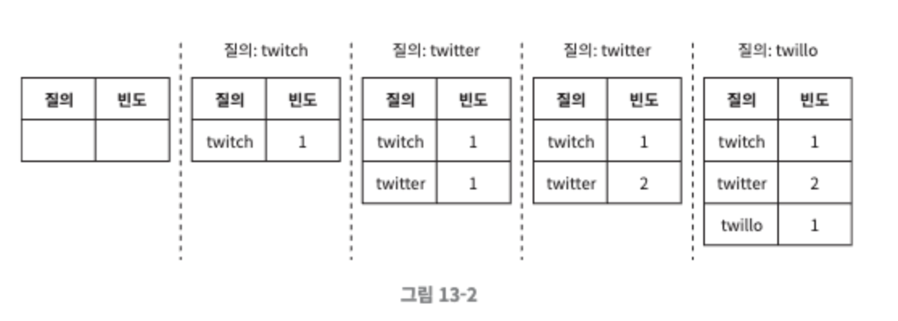

</br></br>

### 질의 서비스

표 13-1과 같은 빈도 테이블이 있는 상태일 때, 두 개의 필드가 있음을 볼 수 있다.

- query : 질의문을 저장하는 필드
- frequency : 질의문이 사용된 빈도를 저장하는 필드

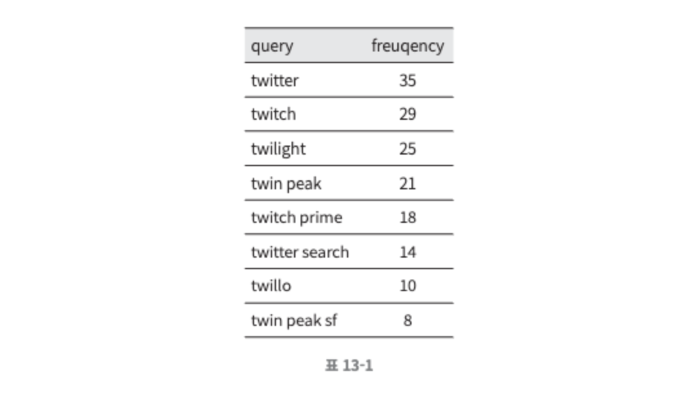

이 상태에서 사용자가 “tw” 입력시 → 아래의 “top5” 자동완성 검색어가 표시되어야 한다. 

“top5”는 위의 빈도 테이블에 기록된 수치를 사용해 계산한다.

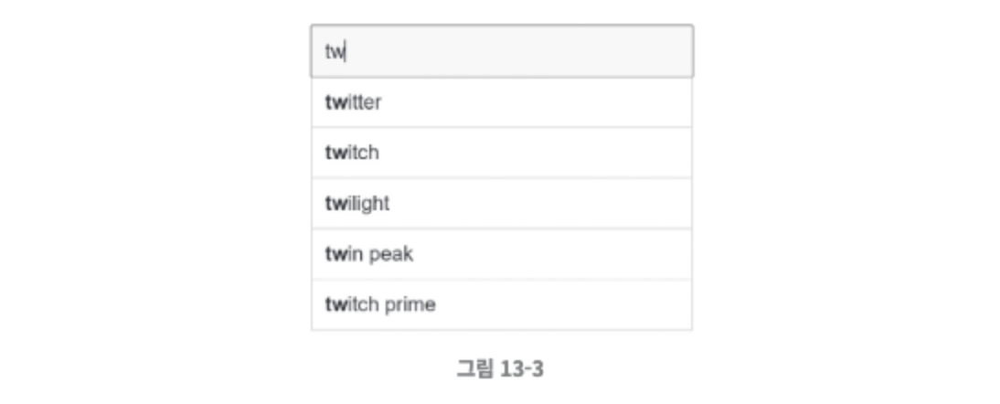

가장 많이 사용된 5개 검색어(”top 5”)는 아래의 SQL 질의문을 사용해 계산할 수 있다.

```jsx
SELECT * FROM frequency_table WHERE query Like 'prefix%'
ORDER BY frequency DESC LIMIT 5
```

</br>

위 설계안은 데이터 양이 적을 때는 나쁘지 않지만, 데이터가 아주 많아지면 데이터베이스가 병목이 될 수 있다. 

</br></br></br>

## 3단계. 상세 설계

이번 절에서는 컴포넌트를 몇 개 골라 보다 상세히 설계하고 다음 순서로 최적화 방안을 논의할 것이다.

- 트라이(trie) 자료구조
- 데이터 수집 서비스
- 질의 서비스
- 규모 확장이 가능한 저장소
- 트라이 연산

</br></br>

### 트라이 자료 구조

관계형 데이터베이스를 이용해 가장 인기 있었던 다섯 개 질의문을 골라내는 방안은 효율적이지 않다. 

해당 문제는 트라이(trie)를 사용해 해결할 것이다. 트라이는 문자열을 간단하게 저장할 수 있는 자료구조로, 트라이라는 이름은 retrieval 이라는 단어에서 왔다. 문자열을 꺼내는 연산에 초점을 맞추어 설계된 자료구조임을 짐작할 수 있다. 

</br>

**트라이 자료구조의 핵심 아이디어**

- 트라이는 트리 형태의 자료구조다.
- 이 트리의 루트 노드는 빈 문자열을 나타낸다.
- 각 노드는 글자 하나를 저장하며, 26개(해당 글자 다음에 등장할 수 있는 모든 글자의 개수)의 자식 노드를 가질 수 있다.
- 각 트리 노드는 하나의 단어, 또는 접두어 문자열(prefix string)을 나타낸다.

</br>

다음 그림은 질의어 ‘tree’, ‘try’, ‘true’, ‘toy’, ‘wish’, ‘win’ 이 보관된 트라이다. 해당 질의어를 나타내는 노드는 굵은 외곽선으로 표시되어있다.

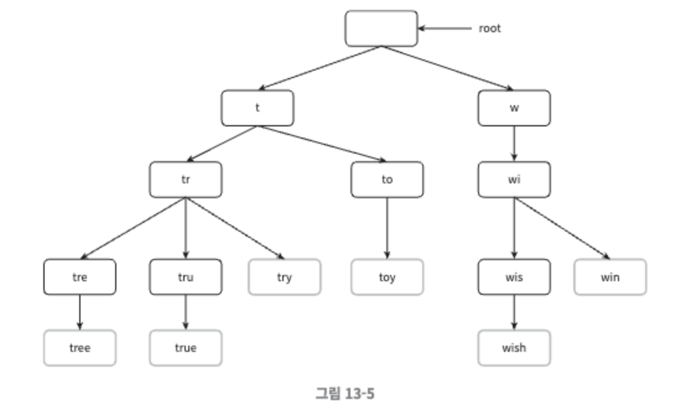

</br>

기본 드라이 자료구조는 노드에 문자들을 저장한다. 이용 빈도에 따라 정렬된 결과를 내놓기 위해서는 노드에 빈도 정보까지 저장할 필요가 있다. 

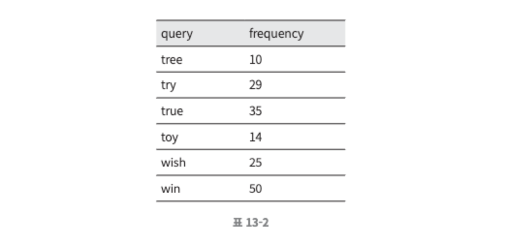

위 빈도 정보를 트라이에 저장하면 다음과 같다.


</br>

트라이로 검색어 자동완성을 만드는 구현 방법을 살펴본다.

- p : 접두어(prefix)의 길이
- n : 트라이 안에 있는 노드 개수
- c : 주어진 노드의 자식 노드 개수

</br>

가장 많이 사용된 질의어 k개는 다음과 같이 찾을 수 있다.

- 해당 접두어를 표현하는 노드를 찾는다. 시간 복잡도는 O(p) 이다.
- 해당 노드부터 시작하는 하위 트리를 탐색하여 모든 유효 노드를 찾는다. 유효한 검색 문자열을 구성하는 노드가 유효 노드다. 시간 복잡도는 O(c) 이다.
- 유효 노드들을 정렬하여 가장 인기있는 검색어 k개를 찾는다. 시간 복잡도는 O(clogc)이다.

</br>

위의 예제를 통해 살펴본다. k=2 이고 사용자가 검색창에 “be”을 입력했다고 할 때 위의 알고리즘은 다음과 같이 동작할 것이다.

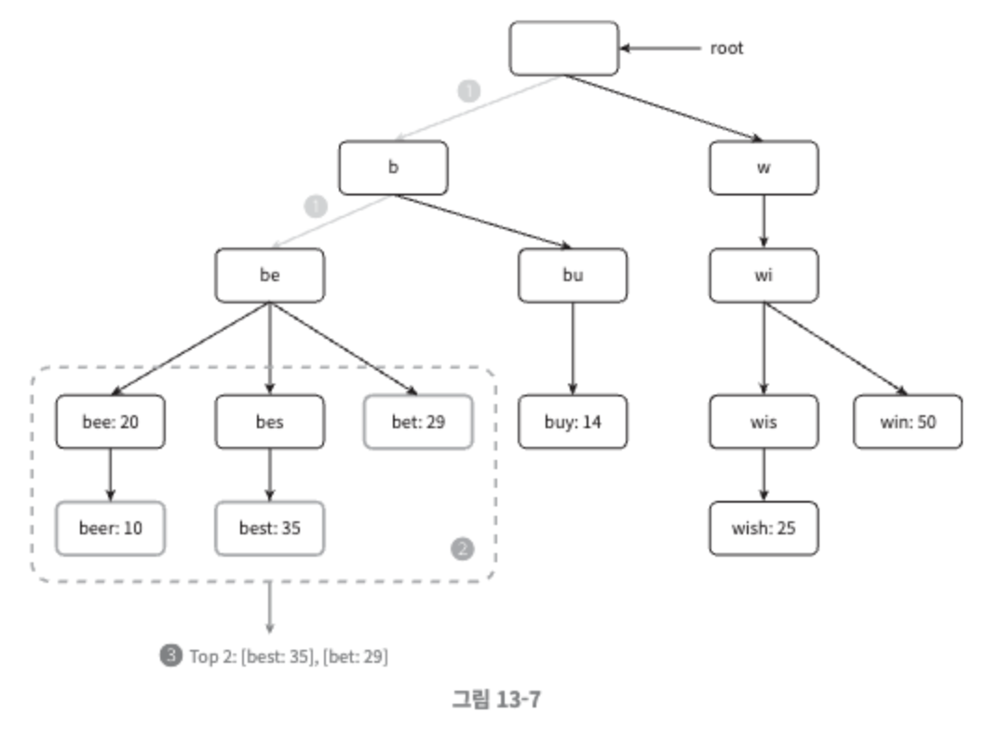

1. 접두어 노드 ‘be’를 찾는다.
2. 해당 노드부터 시작하는 하위 트리를 탐색하여 모든 유효 노드를 찾는다. 그림 13-7의 경우에는 [beer:10], [best: 35], [bet: 29]가 유효노드다.
3. 유효 노드를 정렬하여 2개만 골라낸다. [best: 35]와 [bet:29]가 접두어(즉, 검색어) “be”에 대해 검색된 2개의 인기 검색어다.

</br>

이 알고리즘의 시간 복잡도는 위의 각 단계에 소요된 시간의 합으로, O(p) + O(c) + O(clogc) 이다.

이 알고리즘은 직관적이지만 최악의 경우에는 k개 결과를 얻으려고 전체 트라이를 다 검색해야 하는 일이 생길 수 있다. 이 문제를 해결할 방법으로는 다음의 두 가지가 있다.

- 접두어의 최대 길이를 제한
- 각 노드에 인기 검색어를 캐시

</br>

**접두어 최대 길이 제한**

- 사용자가 검색창에 긴 검색어를 입력하는 일은 거의 없으므로 p값은 작은 정숫값(가령 50)이라고 해도 안전하다.
- 검색어의 최대 길이를 제한할 수 있다면 “접두어 노드를 찾는” 단계의 시간 복잡도는 O(p) 에서 O(작은 상숫값)=O(1)로 바뀔 것이다.

</br>

**노드에 인기 검색어 캐시**

- 각 노드에 k개의 인기 검색어를 저장해 두면 전체 트라이를 검색하는 일을 방지할 수 있다.
    - 5~10개 정도의 자동 완성 제안을 표시하면 충분하기 때문에, k는 작은 값이다. 본 예제에서는 다섯 개 질의를 캐시한다고 가정한다.
- 각 노드에 인기 질의어를 캐시하면 ‘top 5’ 검색어를 질의하는 시간 복잡도를 엄청나게 낮출 수 있지만, 각 노드에 질의어를 저장할 공간이 많이 필요하게 된다는 단점이 있다. 하지만 빠른 응답속도가 아주 중요할 때는 이 정도 저장공간을 희생할 가치가 있다.

</br>

다음은 개선된 트라이 구조다. 

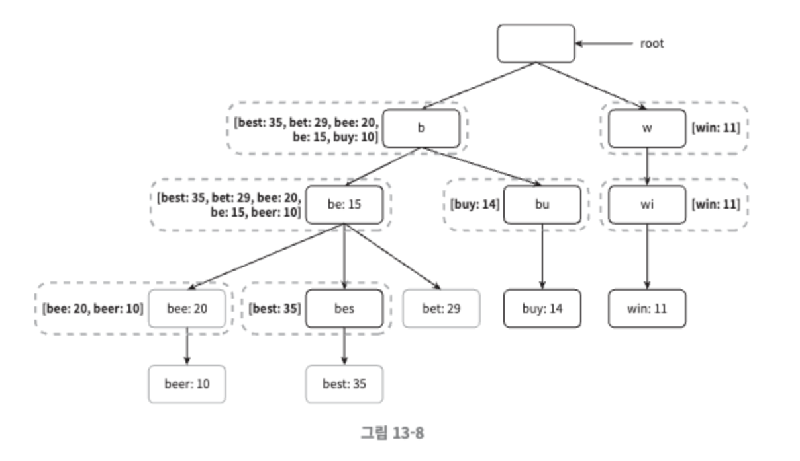

- 각 노드에 가장 인기 있는 검색어 다섯가지를 저장하도록 했다.
    - 예를 들어 접두어 be를 나타내는 노드에는 [best: 35, bet:29, bee: 20, be:15, beer:10 ] 의 다섯 개 검색어를 캐시해 두었다.
- 앞의 두 가지 최적화 기법을 적용하면 시간 복잡도가 어떻게 달라질까?
    - 접두어 노드를 찾는 시간 복잡도는 O(1)로 바뀐다.
    - 최고 인기 검색어 5개를 찾는 질의의 시간 복잡도도 검색 결과가 이미 캐시되어 있기 때문에 O(1)로 바뀐다.
    - 각 단계의 시간 복잡도가 O(1)로 바뀐 덕분에, 최고 인기 검색어 k 개를 찾는 전체 알고리즘의 복잡도도 O(1)로 바뀌게 된다.

</br></br>

### 데이터 수집 서비스

지금까지 살펴본 설계안은 사용자가 검색창에 뭔가 타이핑을 할 때마다 실시간으로 데이터를 수정했는데, 이 방법은 다음 두 가지 문제로 실용적이지 않다.

- 매일 수천만 건의 질의가 입력될 텐데 그때마다 트라이를 갱신하면 질의 서비스는 심각하게 느려질 것이다.
- 일단 트라이가 만들어지고 나면 인기 검색어는 그다지 자주 바뀌지 않을 것이기 때문에 트라이는 그렇게 자주 갱신할 필요가 없다.

</br>

규모 확장이 쉬운 데이터 수집 서비스를 만들려면 데이터가 어디서 오고 어떻게 이용되는지를 살펴야 한다.

트위터 같은 실시간 애플리케이션의 경우 제안되는 검색어를 항상 신선하게 유지할 필요가 있지만, 구글 검색 같은 애플리케이션의 경우 그렇게 자주 바꿔줄 이유는 없다. 용례가 달라지더라도 데이터 수집 서비스의 토대는 바뀌지 않는다. 트라이를 만드는 데 쓰는 데이터는 보통 데이터 분석 서비스(analytics)나 로깅 서비스(logging service)로부터 올 것이기 때문이다.

</br></br>

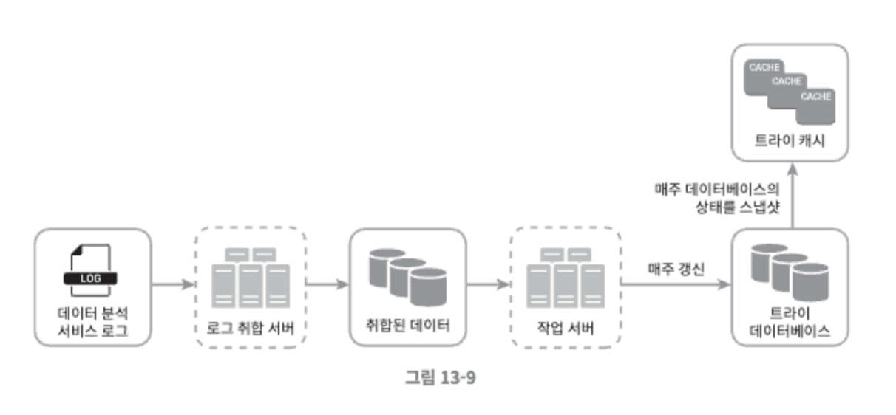

데이터 분석 서비스의 수정된 설계안은 위와 같다. 각 컴포넌트를 살펴본다.

</br>

**데이터 분석 서비스 로그**

데이터 분석 서비스 로그에는 검색창에 입력된 질의에 관한 원본 데이터가 보관된다. 새로운 데이터가 추가될 뿐 수정은 이루어지지 않으며 로그 데이터에는 인덱스를 걸지 않는다. ( 표 13-3 : 로그파일 예제 )

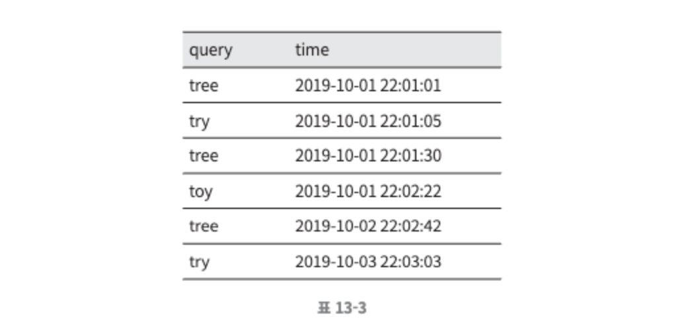

</br>

**로그 취합 서버**

데이터 분석 서비스로부터 나오는 로그는 그 양이 엄청나고 데이터 형식도 제각각인 경우가 많기 때문에 데이터를 잘 취합하여 우리 시스템이 쉽게 소비할 수 있도록 해야한다.

데이터 취합 방식은 서비스의 용례에 따라 달라질 수 있다.

- 트위터와 같은 실시간 애플리케이션의 경우 결과를 빨리 보여주는 것이 중요 → 데이터 취합 주기를 짧게
- 대부분의 경우에는 일주일에 한번 정도로 로그를 취합해도 충분

따라서 **데이터 취합의 실시간성이 얼마나 중요한지 확인**하는 것이 중요하다.

본 설계안에서는 일주일 주기로 취합하면 충분하다고 가정한다.

</br>

**취합된 데이터**

time 필드는 해당 주가 시작한 날짜를 나타내며, frequency 필드는 해당 질의가 해당 주에 사용된 횟수의 합이다.

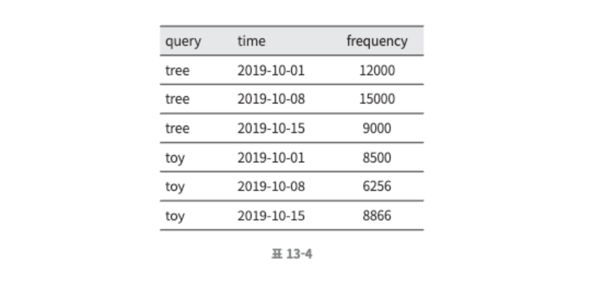

</br>

**작업 서버**

주기적으로 비동기적 작업을 실행하는 서버 집합으로, 트라이 자료구조를 만들고 트라이 데이터베이스에 저장하는 역할을 담당한다.

</br>

**트라이 캐시**

트라이 캐시는 분산 캐시 시스템으로 트라이 데이터를 메모리에 유지하여 읽기 연산 성능을 높이는 구실을 한다. 매주 트라이 데이터베이스의 스냅샷을 떠서 갱신한다.

</br>

**트라이 데이터베이스**

트라이 데이터베이스는 지속성 저장소로, 트라이 데이터베이스로 사용할 수 있는 선택지로는 다음의 두 가지가 있다.

- 문서 저장소 (document store)
    - 새 트라이를 매주 만들 것이기 때문에, 주기적으로 트라이를 직렬화하여 데이터베이스에 저장할 수 있다. 몽고디비와 같은 문서 저장소를 활용하면 이런 데이터를 편리하게 저장할 수 있다.
- 키-값 저장소
    - 트라이는 아래 로직을 적용하면 해시 테이블 형태로 변환 가능하다.
        - 트라이에 보관된 모든 접두어를 해시 테이블 키로 변환
        - 각 트라이 노드에 보관된 모든 데이터를 해시 테이블 값으로 변환
    - 트라이를 해시 테이블로 대응시키는 예시
        
        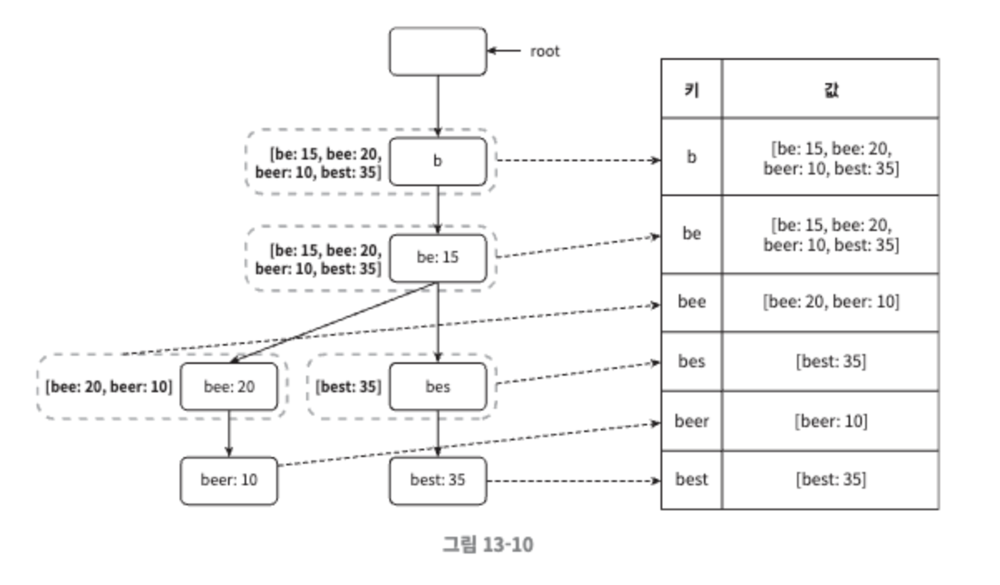
        
        - 그림 13-10에서 각 트라이 노드는 하나의  <키, 값> 쌍으로 변환된다.

</br>

**질의 서비스**

다음은 기존 설계안의 비효율성을 개선한 설계안이다.

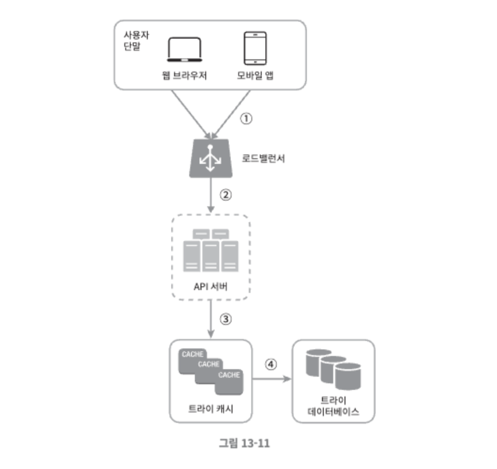

1. 검색 질의가 로드밸런서로 전송된다.
2. 로드밸런서는 해당 질의를 API 서버로 보낸다.
3. API 서버는 트라이 캐시에서 데이터를 가져와 해당 요청에 대한 자동완성 검색어 제안 응답을 구성한다.
4. 데이터가 트라이 캐시에 없는 경우에는 데이터를 데이터베이스에서 가져와 캐시에 채운다. 다음에 같은 접두어에 대한 질의가 오면 캐시에 보관된 데이터를 사용해 처리한다.
    1. 캐시미스(cache miss)는 캐시 서버의 메모리가 부족하거나 캐시 서버에 장애가 있어도 발생할 수 있다.

</br>

질의 서비스는 번개처럼 빨라야 하는데, 이를 위해 다음과 같은 최적화 방안을 생각해볼 수 있다.

- AJAX 요청(request)
    - 웹 애플리케이션의 경우 브라우저는 보통 AJAX 요청을 보내어 자동완성된 검색어 목록을 가져온다. 이 방법의 장점은 요청을 보내고 받기 위해 페이지를 새로고침 할 필요가 없다는 것이다.
- 브라우저 캐싱(browser caching)
    - 대부분 애플리케이션의 경우 자동완성 검색어 제안 결과는 짧은 시간 안에 자주 바뀌지 않는다.
    - 따라서 제안된 검색어들을 브라우저 캐시에 넣어두면 후속 질의의 결과는 해당 캐시에서 바로 가져갈 수 있다. 구글 검색 엔진이 이런 캐시 메커니즘을 사용한다.
    - 구글 검색 엔진에 system design interview라고 입력시 날아오는 응답 헤더에는 `cache-control: private, max-age=3600` 가 포함되어 있다.
        - 구글은 제안된 검색어를 한 시간 동안 캐시해둔다.
        - cache-control 헤더 값에 등장하는 private는 해당 응답이 요청을 보낸 사용자의 캐시에만 보관될 수 있으며 공용 캐시에 저장되어서는 안 된다는 뜻이다.
        - max-age=3600은 해당 캐시 항목은 3600초, 즉 한 시간 동안만 유효하다는 뜻이다.
- 데이터 샘플링
    - 대규모 시스템의 경우 모든 질의 결과를 로깅하도록 해 놓으면 CPU 자원과 저장공간을 엄청나게 소진하게 된다. 데이터 샘플링 기법은 이럴때 유용한데, N개 요청 가운데 1개만 로깅하도록 하는 것이다.

</br></br>

### 트라이 연산

트라이는 검색어 자동완성 시스템의 핵심 컴포넌트다. 트라이 관련 연산들이 어떻게 동작하는지 살펴본다.

</br>

**트라이 생성**

트라이 생성은 작업 서버가 담당하며, 데이터 분석 서비스의 로그나 데이터베이스로부터 취합된 데이터를 이용한다.

</br>

**트라이 갱신**

- 매주 한 번 갱신하는 방법
    - 새로운 트라이를 만든 다음에 기존 트라이를 대체한다.
- 트라이의 각 노드를 개별적으로 갱신하는 방법
    - 본 설계안에서는 성능이 좋지 않아 이 방법을 채택하지 않았지만 트라이가 작을 때는 고려해볼 만하다.
    - 트라이 노드를 갱신할 때는 그 모든 상위 노드도 갱신해야 하는데, 상위 노드에도 인기 검색어 질의 결과가 보관되기 때문이다.
    - 그림 13-13은 이 갱신 연산이 어떻게 동작하는지 보여준다.
        - 트라이의 상태가 왼쪽과 같을 때, 검색어 ‘beer’의 이용 빈도를 10 → 30으로 갱신한다고 가정한다.
        - 해당 노드에 기록된 ‘beer’ 이용 빈도는 오른쪽 그림과 같이 30으로 바뀐다.
        - 아울러 해당 노드의 상위 노드들에 기록된 이용 빈도 수치도 전부 30으로 갱신될 것이다.
            
            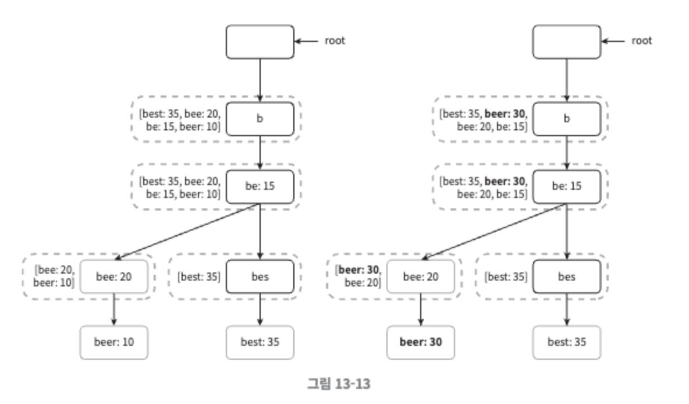
            

</br>

**검색어 삭제**

혐오성이 짙거나, 폭력적이거나, 성적으로 노골적이거나 여러가지로 위협적인 질의어를 자동완성 결과에서 제거해야 한다. 이를 위한 좋은 방법은 트라이 캐시 앞에 필터 계층을 두고 부적절한 질의어가 반환되지 않도록 할 수 있다. 필터 계층을 두면 필터 규칙에 따라 검색 결과를 자유롭게 변경할 수 있다는 장점이 있다.

데이터베이스에서 해당 검색어를 물리적으로 삭제하는 것은 다음번 업데이트 사이클에 비동기적으로 진행하면 된다.

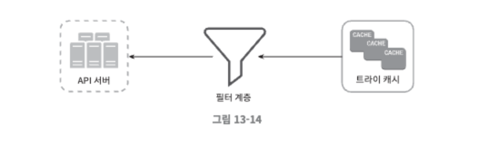

</br></br>

### 저장소 규모 확장

트라이의 크기가 한 서버에 넣기엔 너무 큰 경우의 대응을 위해 규모 확장성 문제를 해결한다.

영어만 지원하면 되기 때문에 간단하게는 첫 글자를 기준으로 샤딩(sharding)하는 방법을 생각해 볼 수 있다.

- 검색어를 보관하기 위해 두 대 서버가 필요하다면 ‘a’ 부터 ‘m’ 까지 글자로 시작하는 검색어는 첫 번째 서버에 저장하고, 나머지는 두 번째 서버에 저장한다.
- 세 대 서버가 필요하다면 ‘a’ 부터 ‘i’ 까지는 첫 번째 서버에, ‘j’ 부터 ‘r’ 까지는 두 번째 서버에, 나머지는 세 번째 서버에 저장한다.

</br>

이 방법을 쓰는 경우 영어 알파벳은 26자 밖에 없기 때문에 사용 가능한 서버는 최대 26대로 제한된다. 그 이상으로 서버 대수를 늘리려면 샤딩을 계층적으로 해야한다. 

- 검색어의 첫 번째 글자는 첫 번째 레벨의 샤딩에 쓰고, 두 번째 글자는 두 번째 레벨의 샤딩에 쓴다.
- ‘a’로 시작하는 검색어를 네 대 서버에 나눠서 보관하고 싶다고 할때, ‘aa’부터 ‘ag’ 까지는 첫 번째 서버에, ‘ah’부터 ‘an’까지는 두 번째 서버에, ‘ao’ 부터 ‘au’ 까지는 세 번째 서버에 나머지는 네 번째 서버에 보관한다.
- 하지만 해당 방법은 각 알파벳으로 시작하는 단어가 일정하지 않기 때문에 데이터를 각 서버에 균등하게 배분하기가 불가능하다.

</br>

해당 문제 해결을 위해 과거 질의 데이터의 패턴을 분석하여 샤딩하는 방법을 사용한다.

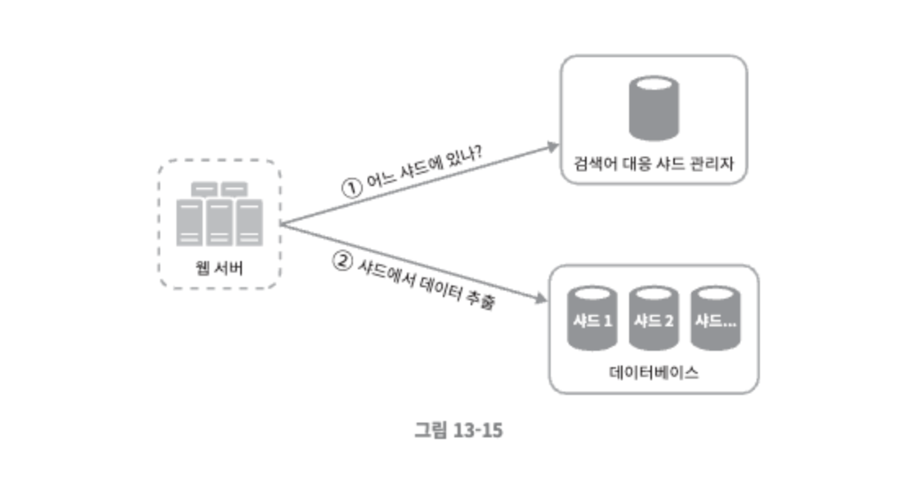

- 이 그림에서 검색어 대응 샤드 관리자는 어떤 검색어가 어느 저장소 서버에 저장되는 지에 대한 정보를 관리한다.
    - ‘s’로 시작하는 검색어의 양이 ‘u’, ‘v’, ‘w’, ‘x’, ‘y’, ‘z’로 시작하는 검색어를 전부 합친 것과 비슷하다면, ‘s’에 대한 샤드 하나와 ‘u’부터 ‘z’까지의 검색어를 위한 샤드 하나를 두어도 충분할 것이다.

</br></br></br>

## 4단계. 마무리

### 상세 설계 이후 추가 질문

- 다국어 지원이 가능하도록 시스템을 확장하려면 어떻게 해야할까?
    - 비영어권 국가에서 사용하는 언어를 지원하려면 트라이에 유니코드 데이터를 저장해야 한다.
    - 유니코드는 고금을 막론하고 세상에 존재하는 모든 문자 체계를 지원하는 표준 인코딩 시스템이다.
- 국가별로 인기 검색어 순위가 다르다면 어떻게 해야할까?
    - 국가별로 다른 트라이를 사용하도록 하면 된다.
    - 트라이를 CDN에 저장하여 응답 속도를 높이는 방법도 생각해볼 수 있다.
- 실시간으로 변하는 검색어의 추이를 반영하려면 어떻게 해야 할까?
    - 새로운 뉴스 이벤트가 생긴다든가 하는 이유로 특정 검색어의 인기가 갑자기 높아질 수 있는데, 현 설계안은 해당 검색어를 지원하는데 적합하지 않다.
        - 작업 서버가 매 주 한번씩만 돌도록 되어 있어서 시의 적절하게 트라이를 갱신할 수 없다.
        - 설사 때맞춰 서버가 실행된다 해도 트라이를 구성하는 데 너무 많은 시간이 소요된다.
    - 실시간 검색어 자동완성 시스템을 구축하는 것은 복잡한 문제다. 도움 될 만한 아이디어는 다음과 같다.
        - 샤딩을 통하여 작업 대상 데이터의 양을 줄인다.
        - 순위 모델을 바꾸어 최근 검색어에 보다 높은 가중치를 주도록 한다.
        - 데이터가 스트림 형태로 올 수 있다는 점, 즉 한번에 모든 데이터를 동시에 사용할 수 없을 가능성이 있다는 점을 고려해야 한다. 데이터가 스트리밍 된다는 것은 데이터가 지속적으로 생성된다는 뜻으로 스트림 프로세싱에는 특별한 종류의 시스템이 필요하다.
            - 아파치 하둡 맵리듀스
            - 아파치 스파크 스트리밍
            - 아파치 스톰
            - 아파치 카프카 등