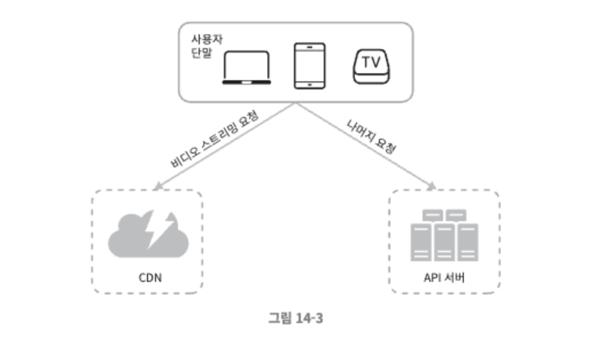
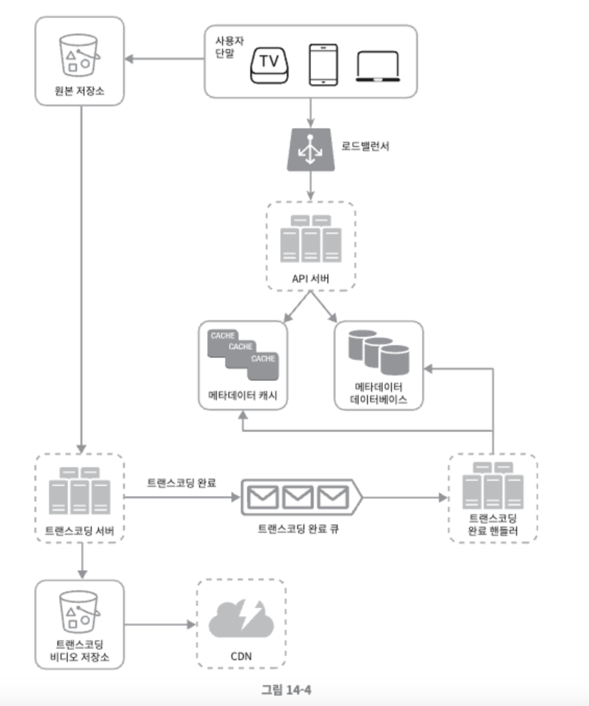
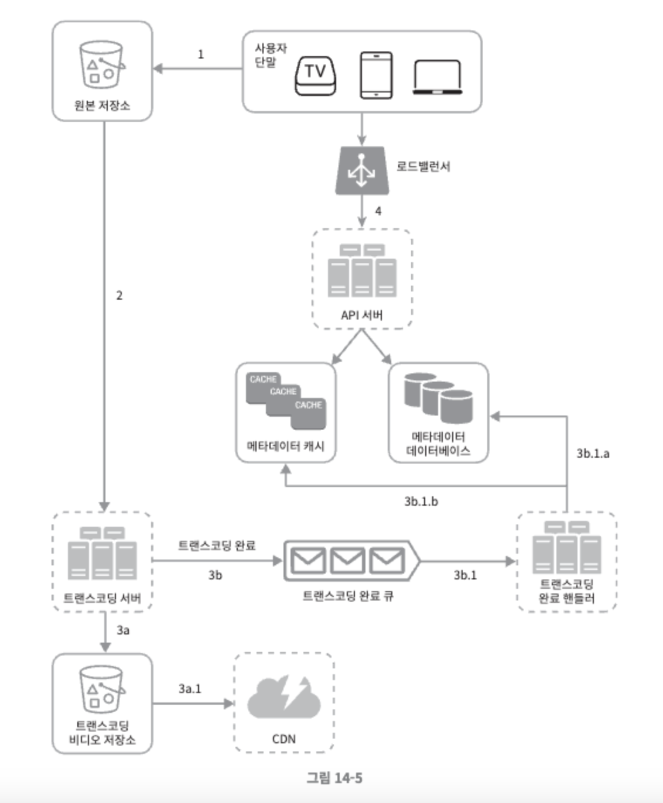
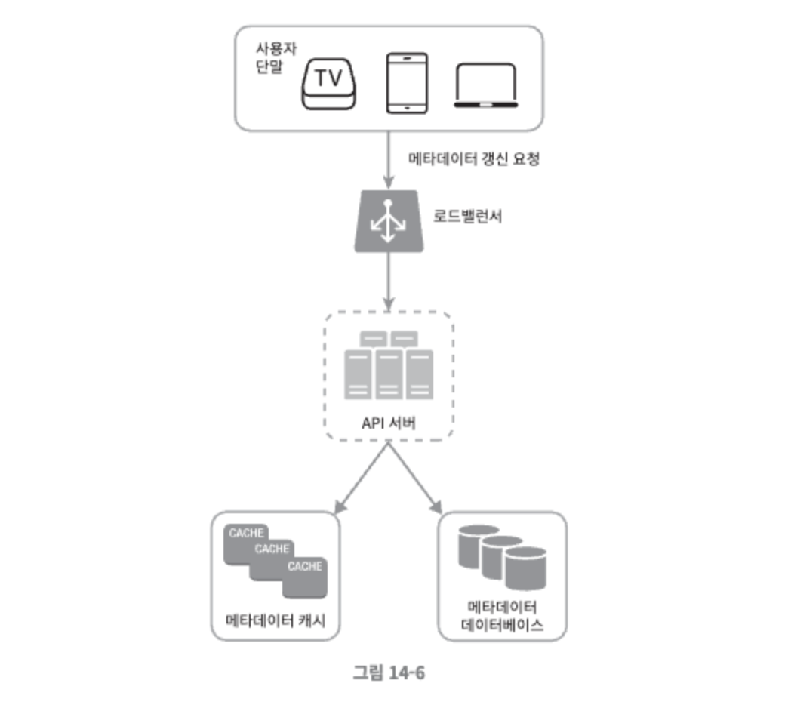

# 14장. 유튜브 설계

유튜브는 간단해보이지만 단순성 이면에 엄청난 기술이 숨어있다. 2020년에 조사된 유튜브의 통계자료는 다음과 같다. 엄청난 규모의 전 지구적 서비스로, 정말 많은 돈을 벌어들이고 있음을 알 수 있다.

- 월간 능동 사용자 수 : 2십 억
- 매일 재생되는 비디오 수 : 5십 억
- 미국 성인 가운데 73%가 유투브 이용
- 5천만명의 창작자
- 유튜브의 많은 광고 수입은 2019년 기준으로 150억 달러이며 이는 2018년도 대비 36%가 증가한 수치
- 모바일 인터넷 트래픽 가운데 37%를 유튜브가 점유
- 80개 언어로 이용 가능

   

## 1단계. 문제 이해 및 설계 범위 확정

유튜브를 통해 할 수 있는 것은 매우 많기 때문에 면접 시간 내에 모든 기능을 설계하는 것은 불가능하다. 적절한 질문을 통해 설계 범위를 좁히도록 한다.

이번장은 아래와 같은 기능을 갖는 비디오 스트리밍 서비스 설계에 초점을 맞춘다.

- 빠른 비디오 업로드
- 원활한 비디오 재생
- 재생 품질 선택 기능
- 높은 가용성과 규모 확장성, 그리고 안정성
- 지원 클라이언트: 모바일 앱, 웹브라우저, 그리고 스마트 TV

 

### 개략적 규모 추정

개략적 추정치는 많은 것을 가정한 결과로, 면접장에서는 면접관에게 가정한 사항들을 알리고 동의를 구해야한다.

- 일간 능동 사용자(DAU) 수는 5백만
- 한 사용자는 하루에 평균 5개의 비디오를 시청
- 10%의 사용자가 하루에 1비디오 업로드
- 비디오 평균 크기는 300MB
- 비디오 저장을 위해 매일 새로 요구되는 저장 용량 = 5백만 x 10% x 300MB = 150TB
- CDN 비용
    - 클라우드 CDN을 통해 비디오를 서비스할 경우 CDN에서 나가는 데이터의 양에 따라 과금한다.
    - 아마존의 클라우드프론트를 CDN 솔루션으로 사용할 경우, 100% 트래픽이 미국에서 발생한다고 가정하면 1GB당 $0.02의 요금이 발생한다. 문제의 단순화를 위해 비디오 스트리밍 비용만 따진다.
    - 따라서 매일 발생하는 요금은 5백만 x 5비디오 x 0.3GB x $0.02 = $150,000 이다.

 

이 추정 결과에 따르면 CDN을 통해 비디오를 서비스하면 비용이 엄청나다. 이 비용을 줄이는 방법에 대해서는 상세 설계를 진행하면서 자세히 알아본다.

   

## 2단계. 개략적 설계안 제시 및 동의 구하기

여기서 제시하는 설계안은 CDN과 BLOB 스토리지의 경우에는 기존 클라우드 서비스를 활용할 것이다. 이유는 다음과 같다.

- 시스템 설계 면접은 모든 것을 밑바닥부터 만드는 것이 관계있는 것이 아니다. 주어진 시간 안에 적절한 기술을 골라 설계를 마치는 것이 그 기술 각각이 어떻게 동작하는 상세히 설명하는 것보다 중요하다.
    - 예를 들어 비디오 저장을 위해 BLOB 저장소를 쓸 것이라면 그 사실만 언급해도 충분하다. 해당 저장소를 어떻게 구현할지 상세한 설계를 하는 것은 지나치다.
- 규모 확장이 쉬운 BLOB 저장소나 CDN을 만드는 것은 지극히 복잡할 뿐 아니라 많은 비용이 든다. 넷플릭스나 페이스북 같은 큰 회사도 모든 것을 스스로 구축하지는 않는다.

 

개략적으로 보면 이 시스템은 다음의 세 개 컴포넌트로 구성된다.

- 단말(client) : 컴퓨터, 모바일, 폰, 스마트 TV를 통해서 유튜브를 시청할 수 있다.
- CDN : 비디오는 CDN에 저장한다. 재생 버튼을 누르면 CDN으로부터 스트리밍이 이루어진다.
- API 서버 : 비디오 스트리밍을 제외한 모든 요청은 API 서버가 처리한다. 피트 추천, 비디오 업로드 URL 생성, 메타데이터 데이터베이스와 캐시 갱신, 사용자 가입 등 처리한다.

 

면접관이 두 영역 설계를 요청했다고 가정한다.

- 비디오 업로드 절차
- 비디오 스트리밍 절자

  

### 비디오 업로드 절차

그림 14-4는 비디오 업로드 절차의 개략적 설계안으로, 다음과 같은 컴포넌트들로 구성되어 있다.

- 사용자 : 컴퓨터나 모바일 폰, 혹은 TV를 통해 유튜브를 시청하는 이용자
- 로드밸런서 : API 서버 각각으로 고르게 요청을 분산하는 역할을 담당한다.
- API 서버 : 비디오 스트리밍을 제외한 다른 모든 요청을 처리한다.
- 메타데이터 데이터베이스 : 비디오의 메타데이터를 보관한다. 샤딩과 다중화를 적용하여 성능 및 가용성 요구사항을 충족한다.
- 메타데이터 캐시 : 성능을 높이기 위해 비디오 메타데이터와 사용자 객체는 캐시한다.
- 원본 저장소 : 원본 비디오를 보관할 대형 이진 파일 저장소(BLOB) 시스템이다. BLOB 저장소는 “이진 데이터를 하나의 개체로 보관하는 데이터베이스 관리 시스템” 이다.
- 트랜스코딩 서버 : 비디오 트랜스코딩은 비디오 인코딩이라 부르기도 하는 절차로, 비디오의 포맷(MPEG, HLS 등)을 변환하는 절차다. 단말이나 대역폭 요구사항에 맞는 최적의 비디오 스트림을 제공하기 위해 필요히다.
- 트랜스코딩 비디오 저장소 : 트랜스코딩이 완료된 비디오를 저장하는 BLOB 저장소다.
- CDN : 비디오를 캐시하는 역할을 담당한다. 사용자가 재생 버튼을 누르면 비디오 스트리밍은 CDN을 통해 이루어진다.
- 트랜스코딩 완료 큐 : 비디오 트랜스코딩 완료 이벤트들을 보관할 메시지 큐
- 트랜스코딩 완료 핸들러 : 트랜스코딩 완료 큐에서 이벤트 데이터를 꺼내어 메타데이터 캐시와 데이터베이스를 갱신할 작업 서버들이다.

 

비디오 업로드는 어떻게 처리될까? 다음의 두 프로세스가 병렬적으로 수행된다.

A. 비디오 업로드

B. 비디오 메타데이터 갱신, 메타데이터에는 비디오 URL, 크기, 해상도, 포맷, 사용자 정보가 포함된다.

 

**프로세스 A: 비디오 업로드**

그림 14-5는 비디오 업로드가 어떻게 이루어지는지를 보여준다. 요약하면 아래와 같다.

1. 비디오를 원본 저장소에 업로드한다.
2. 트랜스코딩 서버는 원본 저장소에서 해당 비디오를 가져와 트랜스코딩을 시작한다.
3. 트랜스코딩이 완료되면 아래 두 절차가 병렬적으로 수행된다.
    1. 완료된 비디오를 트랜스코딩 비디오 저장소로 업로드한다.
    2. 트랜스코딩 완료 이벤트를 트랜스코딩 완료 큐에 넣는다.
        1. 트랜스코딩이 끝난 비디오를 CDN에 올린다.
        2. 완료 핸들러가 이벤트 데이터를 큐에서 꺼낸다.
        3. 완료 핸들러가 메타데이터 데이터베이스과 캐시를 갱신한다.
4. API 서버가 단말에게 비디오 업로드가 끝나서 스트리밍 준비가 되었음을 알린다.

 

**프로세스 B : 메타데이터 갱신**

원본 저장소에 파일이 업로드되는 동안, 단말은 병렬적으로 비디오 메타데이터 갱신 요청을 API 서버에 보낸다. 이 요청에 포함된 메타데이터에는 파일 이름, 크기, 포맷 등의 정보가 들어있다. API 서버는 이 정보로 메타데이터 캐시와 데이터베이스를 업데이트 한다.

  

### 비디오 스트리밍 절차

유튜브에서 비디오 재생버튼을 누르면 스트리밍은 바로 시작되며 다운로드가 완료되어야 영상을 볼 수 있다거나 하는 불편함은 없다. (다운로드는 비디오를 단말로 내려받는 것을 말하며, 스트리밍은 장치가 원격지의 비디오로부터 지속적으로 비디오 스트림을 전송 받아 영샹을 재생하는 것을 말한다.)

- 스트리밍 프로토콜(streaming protocol)
    - 비디오 스트리밍을 위해 데이터를 전송할 때 쓰이는 표준화된 통신방법
        - MPEG-DASH, MPEG “Moving picture Experts Group” 의 약어, DASH “Dynamic Adaptive Streaming over HTTP”의 약어이다.
        - 애플 HLS, HLS는 “HTTP Live straming”의 약어
        - 마이크로소프트 스무드 스트리밍
        - 어도비 HTTP 동적 스트리밍

이 프로토콜의 동작원리를 정확하게 이해하거나 그 이름을 외울 필요는 없다. 기억해야 할 것은 프로토콜마다 지원하는 비디오 인코딩이 다르고 플레이어도 다르다는 것이다. 따라서 비디오 스트리밍 서비스를 설계할 때는 서비스의 용례에 맞는 프로토콜을 잘 골라야 한다.

 

비디오는 CDN 에서 바로 스트리밍 되며, 사용자의 단말에 가장 가까운 CDN 에지 서버가 비디오 전송을 담당할 것이므로 전송지연은 아주 낮다.

   